# UX Design Specification sprinty

**Author:** Ducdo
**Date:** 2026-03-16

---

## Executive Summary

### Project Vision

AI Life Coach is a native iOS coaching system built on three pillars — Clarity, Connection, and Joy. The product differentiates through the Directive Trust Gap: an AI that earns the right to give confident, personalized guidance through deep understanding, then backs it up with contingency plans and the integrity to recognize its own limits. The MVP presents a single unified coach with conversation-first interaction, sprint-based goal architecture, a simple 2D avatar system, and always-on clinical safety boundaries. Cloud-first architecture with tier-based model routing (lightweight free, premium paid) and on-device Apple Foundation Models for zero-cost safety classification.

### Target Users

Four primary personas represent the spectrum of user entry states:

- **Maya, 29 ("The Stuck Striver")** — Junior PM paralyzed by optionality. Needs Discovery Mode to articulate what she wants. Entry emotion: mental fog. Success moment: "I finally put into words what I've been circling for months."
- **Marcus, 37 ("The Crisis Navigator")** — Laid-off engineer with colliding life domains. Needs Directive Mode now. Entry emotion: overwhelm. Success moment: "My coach connected career and finances without me explaining the link."
- **Priya, 44 ("The Quiet Optimizer")** — Returning professional feeling adrift. Needs gentle pattern surfacing and the RPG layer. Entry emotion: drift. Success moment: "The AI noticed something about me I hadn't seen."
- **Alex, 32 ("The Self-Directed Builder")** — Self-taught developer wanting honest pushback. Needs Challenger + structured sprints. Entry emotion: plateau. Success moment: "The first app that treats me like an adult."

Secondary users include accountability partners (social wall visitors), curious skeptics (organic acquisition channel), and future enterprise buyers.

### Key Design Challenges

1. **Coaching-as-Onboarding: One Emotional Container** — The existential UX challenge. The onboarding flow is fixed (welcome → avatar → first conversation), but the emotional tone must serve Maya's fog, Marcus's urgency, Priya's drift, Alex's impatience, and the Curious Skeptic's "I don't know why I'm here" — simultaneously. This is a tone and visual design problem, not a flow problem. The AI adapts the conversation; the UX must create a single emotional container warm enough, grounded enough, and open enough for every entry state. Get this wrong and Day-7 retention (target: 40%, double industry benchmark) is dead on arrival. **Validation method:** Persona-based walkthrough scenarios must be conducted at design time — literally walk through the onboarding as each persona and the cold-start Skeptic. If the container feels wrong for any of them on paper, it will feel wrong in production.

2. **Home Screen: Unified Scene, Not Component Grid** — The home screen communicates avatar state, sprint progress, coach access, and last insight — but it must feel like a living *place*, not a cluttered dashboard. Architecture decision: the home screen is a **single unified scene** with the avatar as the emotional center and all other elements woven into the environment — not a grid of independent dashboard components. This yields a single cohesive data model, better rendering performance, and naturally supports the "calm place" goal. Favor intentional status display over real-time animated complexity. The avatar is the soul; everything else supports, not competes.

3. **Conversation UI Beyond Chat** — Every competitor opens with a chat bubble or a questionnaire. This UI must signal "this is coaching" through visual design that supports streaming responses, mode transitions (Discovery ↔ Directive), Challenger moments, and clinical boundary shifts — without looking like iMessage or ChatGPT. **MVP approach: ambient mode transitions.** Mode shifts are conveyed through subtle environmental cues (color temperature, background atmosphere, typography weight) — not explicit UI state changes like banners or mode indicators. The AI's *words* carry the meaning of the transition; the UI provides the emotional backdrop. Explicit mode UI deferred to post-MVP. This is architecturally simpler (no complex UI state machine) and truer to the coaching metaphor — a real coach shifts tone, not signage. **Typography and whitespace are coaching signals** — generous line spacing, breathing room between messages, leveraging San Francisco and dynamic type. The visual rhythm of reading should feel like a conversation with someone who pauses and thinks, not a wall of text or a chat stream.

4. **Sprint Progress: Narrative Bookends, Spatial Glanceability** — Sprint visualization operates in two UX modes for the same underlying data. **Narrative mode** for sprint setup and retrospective — bookend moments where storytelling adds meaning ("here's the chapter we're writing together," "here's how the story unfolded"). **Spatial mode** for daily use — minimal, glanceable, "you are here on the path" with a trail marker, not a paragraph. The narrative framing survives first contact; the spatial view survives day 14. Think less Jira, less novel — more illustrated trail map that zooms into story at key moments.

5. **Invisible Safety UX with Discrete Testable States** — The clinical boundary system (Green → Yellow → Orange → Red) must shift the entire UI tone seamlessly — without making users feel flagged or pathologized. The transition should feel like the app is taking care of you, not diagnosing you. **Each tier must be specified as a discrete, testable UI state** with explicit definitions for: color palette shift, avatar posture/expression change, which UI elements hide (gamification elements removed at Orange+, sprint progress removed at Red), which elements appear (professional resources, crisis contacts), and notification behavior changes. If a user in Orange still sees sprint progress bars, that's a bug, not a design opinion.

### Design Opportunities

1. **Category-Defining First Impression** — Every competitor opens with a chat bubble. An avatar-centered, intentional opening screen — not a blinking cursor — exploits the single biggest gap in the competitive landscape. This isn't just a differentiator; it's a category-defining moment. The first 5 seconds set expectations for everything that follows.

2. **Avatar as Emotional Mirror** — A visual character reflecting coaching state (armored for challenges, resting during pause) creates emotional bonds no text-only competitor can match. Sometimes the avatar should just be sitting there, content — doing nothing is a design statement. As the centerpiece of the unified home scene, the avatar grounds the entire experience in something personal and alive. Seeds the full RPG system in Phase 2.

3. **Memory-as-UX: Making Trust Visible** — Persistent memory is the Directive Trust Gap made tangible — not just a backend capability but a design opportunity. When the coach references something from three weeks ago, the UX must *support the surprise*: subtle visual treatment for memory-referenced moments in conversation (distinguishing "the AI remembers" from regular responses), and a home screen "last insight" that feels like a note from someone who genuinely knows you. If past references are buried in scrolling chat, the trust moment evaporates. Surfaced intentionally, trust compounds visually over time. This is how the product earns the right to be directive — not just through AI depth, but through the user *seeing* that depth reflected in the interface.

4. **The Contrast Principle** — Restraint is not the goal; *contrast* is. The app is calm, quiet, and restrained 95% of the time — so that the 5% when it acts lands with emotional weight. A haptic at sprint completion is powerful because your phone was silent for two weeks. A memory reference hits because the app wasn't constantly reminding you of past conversations. The avatar putting on armor resonates because it was sitting peacefully yesterday. Notifications are rare so they mean something. Fewer, more polished Lottie animations over a catalogue of mediocre ones. Ambient mode transitions over explicit UI banners. Every design decision asks: "Does this serve the calm, or does this serve the moment?" — and both answers are correct in their place. Restraint creates the conditions; contrast delivers the emotion.

5. **Pause Mode as Design Statement** — Visual transformation during rest (calmer palette, sleeping avatar, muted UI) makes the brand promise tangible. An app that visually quiets itself when it tells you to rest is making a promise no competitor makes. The contrast with active coaching state makes both modes more meaningful.

### UX Validation Approach

Persona-based walkthrough scenarios are a first-class validation method in this UX spec, not a post-launch afterthought. Validation follows a strict priority hierarchy — higher tiers must be validated before lower tiers receive design investment.

**Tier 1 — Existential (validate first, no exceptions):**
- **Onboarding emotional container:** Does the same tone/visual work for Maya's fog, Marcus's urgency, Priya's drift, Alex's impatience, and "I don't know why I'm here"?
- **First conversation experience:** Does the conversation UI feel like coaching from message one? Does typography and whitespace create the right rhythm? Do ambient cues register emotionally?

**Tier 2 — Core Experience:**
- **Home scene:** Does the unified scene feel calm for a resting user and purposeful for a mid-sprint user? Does the "last insight" memory surface feel personal, not algorithmic?
- **Memory-as-UX moments:** Do memory references in conversation land as trust-building surprises or get lost in the stream?

**Tier 3 — Supporting Systems:**
- **Sprint display:** Does narrative mode add meaning at bookends? Does spatial mode survive daily glanceability at day 14?
- **Safety transitions:** Are all four tiers visually distinct and testable as discrete UI states? Does Orange remove all gamification elements?
- **Conversation ambient shifts:** Do environmental cues for Discovery/Directive/Challenger register without demanding conscious attention?
- **Pause Mode:** Does the visual transformation feel like care, not shutdown?

## Core User Experience

### The Core Loop

The core loop of AI Life Coach is:

> **User opens app → sees their avatar and last insight on the home scene → taps to talk to their coach → has a conversation that feels like coaching → closes the app feeling heard.**

Everything in this specification exists to make that loop work. Every design decision, every interaction, every visual choice serves these five steps. If a decision doesn't serve the core loop, it waits. The lexicon, the Calm Budget, the proxy signals, the experience principles — they are all in service of making this loop *feel right*.

### Defining Experience

The core user experience is the **coaching conversation**. Every other element — home scene, avatar, sprint visualization, Pause Mode — exists to support, enhance, or return the user to this central exchange. Users will spend the majority of their active time in conversation with their coach — from the first onboarding exchange through daily check-ins, deep sessions, sprint planning, and Challenger moments.

The conversation is not a feature of the product; it is the product. Design priority always flows toward making the next conversation more meaningful than the last.

### Experience Principles

*These principles operate within a single foundational mental model: **this is a coaching relationship, not a software interaction.** Every principle below serves this frame. Anyone reading this spec — designer, developer, QA — should evaluate their work against this question: "Does this feel like something a thoughtful coach would do, or something a software product would do?" When in tension, the coaching relationship wins.*

Five principles guide every UX decision in this specification:

1. **Conversation is the product.** Every other element exists to support, enhance, or return the user to the coaching conversation. The conversation engine is not a feature — it's the foundation everything else is built on. When in doubt about any design decision, ask: "Does this make the next conversation better?" **Testable:** Every view has a path to conversation in ≤1 tap.

2. **Earned depth, not assumed familiarity.** The app starts warm but not presumptuous. Every personal reference, every directive suggestion, every Challenger pushback is earned through demonstrated understanding. **For MVP, this principle lives in AI behavior, not UI state** — the coach's words carry the progression while the visual design remains consistent. The UX does not change based on relationship maturity in MVP. **Phase 2 design seams:** The following visual dimensions are candidates for relationship-driven progression in future releases — home scene density/richness, conversation ambient warmth, avatar expressiveness range, and depth of memory surfaces. These seams should be noted in component design but not built in MVP.

3. **Calm until it counts (The Calm Budget).** The Contrast Principle as a lived experience with testable constraints. The default state is quiet, restrained, and intentional — so when the app acts, it carries weight. The Calm Budget defines hard limits:
   - **Haptic trigger types:** ≤3 in MVP — sprint step/goal completion, Challenger pushback acknowledgment, milestone achievement. No other interactions produce haptic feedback.
   - **Push notifications:** ≤1 per day maximum. Zero during Pause Mode. Zero unsolicited sounds — haptics only, never audio.
   - **Avatar state changes:** Triggered by coaching state transitions only (active, resting, celebrating, thinking, struggling), never on a timer or schedule.
   - **Home scene memory surface:** 1 insight displayed, refreshed per completed session, not real-time.
   - **The test:** If any single day produces more than 3 haptic events, 1 notification, or an unprompted avatar change, the Calm Budget is broken and the design has a bug.

4. **One tap to what matters.** Every primary action — talk to coach, check sprint, activate Pause Mode — is one interaction away from the home scene. No navigation hierarchies, no buried features, no decisions before value. The home scene pre-fetches conversation context so "one tap" means one tap to *being in conversation*, not one tap to a loading state. Cognitive load is the enemy; every added step must justify its existence. **Testable:** Navigation depth audit — every primary action ≤1 tap from home scene.

5. **The app disappears into the coaching.** The best UX moment is when the user forgets they're using an app and feels like they're talking to someone who knows them. Typography, whitespace, ambient transitions, and the absence of chrome all serve this goal. The interface is a space to inhabit, not a tool to operate. **Validation:** This principle requires user testing protocols — task completion without conscious UI awareness. Cannot be automated; measured through qualitative research in usability sessions.

### Platform Strategy

**Native iOS first.** The platform choice is not just distribution — it's a UX capability decision:

- **San Francisco typography + Dynamic Type** — The coaching conversation demands typographic excellence. Generous line spacing, breathing room between messages, and system-level accessibility support create the "someone who pauses and thinks" reading rhythm.
- **Haptic Engine** — Reserved for milestone moments only (Contrast Principle). Governed by the Calm Budget (see Experience Principles). Rare enough to feel alive, not habitual.
- **Apple Foundation Models (on-device)** — Clinical boundary classification runs locally at zero cost, zero latency, offline-capable. Safety never depends on connectivity.
- **Local SQLite + sqlite-vec** — All personal data (RAG summaries, embeddings, profiles, sprint state) stays on-device. The "coach who knows you" data layer never leaves the phone.
- **Lottie animations + native transitions** — Polished avatar state changes and transitions that web apps cannot replicate. Fewer, higher-quality animations per the Contrast Principle.
- **Offline capability** — Safety classification always works. Conversation history and sprint state always accessible. Cloud connectivity required only for active coaching conversations (LLM inference).
- **Zero unsolicited sounds** — No chimes, no alert tones, no audio feedback. Haptics only. Sound is the fastest way to make an app feel needy.

**Android deferred to Phase 2** post-validation. The premium coaching experience demands native polish that cross-platform frameworks compromise.

### Effortless Interactions

Seven interactions must feel like zero cognitive effort. The first is the emotional foundation; the remaining six are functional. The emotional interaction is not seventh in priority — it is the precondition that makes all functional interactions meaningful.

**The Foundation:**

1. **Being honest feels safe.** The emotional effortless interaction that differentiates a coaching product from a chatbot — and the moat of the entire product. Users will share career fears, relationship struggles, financial anxiety, and feelings of being lost. The conversation UI must communicate privacy and intimacy through design — no visible logging indicators, no surveillance-feeling typing indicators, no export or share buttons on sensitive conversations. The coaching space feels like a private room, not a chat window with a save button. The visual language says "this is between us" without saying it in words. The privacy communication during onboarding ("your personal data stays on your phone") is the explicit promise; the ongoing visual design is the implicit reinforcement at every turn. Replika feels performative. ChatGPT feels transactional. If this app feels *private*, vulnerability becomes effortless. **When this is true, every interaction below becomes more meaningful. When it isn't, nothing else matters.**

**The Functional Six:**

2. **Returning to your coach** — One tap from the home scene. The primary "Talk to your coach" action is always visible, never buried. No navigation, no menus, no decisions before the conversation begins. **The home scene pre-fetches RAG context** so the conversation view opens already warm — no visible retrieval delay, no loading spinner, no "remembering..." state. Pre-fetching is a home scene responsibility: conversation context must be ready before the user taps. Without this, "one tap" is really "one tap + wait."

3. **Daily check-ins** — 30 seconds or less. The coach initiates with a focused question, the user responds, done. No ceremony, no mandatory fields, no friction between "I opened the app" and "I'm done checking in."

4. **Resuming context** — The user never re-explains anything. When they open a conversation, the coach already knows what happened last time. The RAG system and structured profiles work invisibly so the user experiences continuity, not repetition. Effortlessness through the absence of "remind me what we talked about." The pre-fetched context from the home scene ensures this continuity is instant, not loaded.

5. **Pausing** — One gesture to activate Pause Mode. No guilt, no confirmation dialog, no "are you sure?" The app respects the decision instantly — avatar goes to rest, UI quiets, coaching backs off. Resuming is equally effortless.

6. **Sprint progress at a glance** — The spatial "you are here on the path" view communicates status from the home scene without tapping, scrolling, or reading. Glanceable in under 2 seconds. The user knows where they stand the moment the app opens.

7. **Switching depth** — The conversation entry point accommodates both a deep session and a quick check-in without different modes, paths, or UI decisions. The coach reads the user's tone and adjusts. The user just talks.

### Critical Success Moments

Six moments determine whether the product wins or loses a user. Each moment includes a narrative description (what the team should *feel* when designing for it) and a proxy signal (what the team can *measure* to validate it).

**Note:** These moments are presented sequentially but real users aren't linear. Marcus may hit the Challenger moment in session one. Priya may stay in Discovery Mode for a month before sprint setup. The Curious Skeptic may leave before any moment beyond zero occurs. Each moment must stand independently — they are not gates in a funnel.

0. **"I feel welcome here"** *(App launch, first 5 seconds)* — Before the coach speaks, before the avatar is chosen, before anything. The welcome moment, the brand tone, the first line of text. This is the only moment that is identical for every persona — Maya, Marcus, Priya, Alex, and the Curious Skeptic all see the same thing. The emotional container either holds or leaks in these 5 seconds. If the welcome feels generic, clinical, or like every other app's splash screen, the user's guard goes up before the coach gets a chance. **Failure mode:** A sterile onboarding screen that looks like a SaaS signup or a chatbot greeting. **Proxy signal:** Time from app launch to first conversation input < 90 seconds.

1. **"It actually listened"** *(First conversation, ~3 minutes in)* — The coach asks a question that makes the user pause and think. Not generic — sharp, curious, specific to what the user just said. This is where Maya articulates what she's been circling, Marcus feels understood without over-explaining, and the Skeptic thinks "okay, this is different." **Failure mode:** Generic opening questions that feel like every other AI chatbot. **Proxy signal:** First conversation produces at least one user message > 50 words.

2. **"It remembers me"** *(Second session, day 2-3)* — The coach picks up where they left off — not with a summary, but with a reference that shows real continuity. "Yesterday you mentioned feeling energized when you talked about that side project..." This is the Memory-as-UX trust moment where the relationship begins compounding. **Failure mode:** The coach starts fresh or delivers a mechanical recap. **Proxy signal:** Second session's first coach message references a specific detail from session one (detectable via RAG retrieval logs).

3. **"My coach has a plan"** *(First sprint setup, ~week 2)* — The transition from exploratory conversation to structured action. The coach says "based on everything we've discussed, here's what I think we should focus on for the next two weeks" — and it's *right*. Vague aspirations reflected back as concrete, achievable steps. This is where "conversation" becomes "system." **Failure mode:** Goals feel imposed rather than earned, or the plan doesn't reflect the conversations that preceded it. **Proxy signal:** Sprint creation within 14 days for >60% of users with 3+ conversations.

4. **"It pushed back — and it was right"** *(First Challenger moment)* — The coach respectfully challenges a decision, provides reasoning, and immediately follows with "but if you want to go ahead, here's how we'll do it and here's Plan B." The user feels treated like an adult. **Failure mode:** The pushback feels condescending, or the AI hedges instead of committing to a perspective. **Proxy signal:** Challenger activations where user continues conversation (no bounce).

5. **"It knew when to stop"** *(First Pause Mode suggestion)* — After sustained intensity, the coach says "You've been pushing hard. Want to take a breather?" The avatar goes to rest. The UI quiets. The user feels *cared for*, not optimized. **Failure mode:** The suggestion feels like disengagement, or the app keeps nudging during rest. **Proxy signal:** Pause Mode acceptance rate on AI-suggested pauses.

### Priority Stacks

Two parallel prioritizations ensure engineering knows what to ship first and design knows what to decide first. These stacks exist because a 14-week solo developer build cannot treat everything as equally important.

**MVP launch requires all 7 priority levels. Priority determines build *order*, not build *scope*.**

**Build Priority (what ships first):**

| Priority | What | Why |
|----------|------|-----|
| 1 | Conversation works and feels like coaching | The core loop dies without this. Moments 0 and 1. |
| 2 | Home scene with one-tap to conversation | The core loop's entry point. The "place" that makes users return. |
| 3 | RAG memory so the coach remembers | Moment 2. The trust-building differentiator. Without memory, it's just another chatbot. |
| 4 | Avatar with basic states on home scene | The emotional differentiator. The Joy pillar's seed. What makes a screenshot shareable. |
| 5 | Check-ins work | Effortless Interaction #3. The lightweight daily touchpoint that builds habit. |
| 6 | Sprint progress display | The "system, not chat" proof point. Spatial glanceability on home scene. |
| 7 | Everything else | Pause Mode, Calm Budget enforcement, pre-fetch optimization, Challenger polish, narrative sprint bookends, safety tier visual transitions. Ships in the second half of the build, before launch. |

**Design Priority (what gets designed first, even if it ships later):**

| Priority | What | Why |
|----------|------|-----|
| 1 | Visual language for quiet/active states | Shared across home scene, Pause Mode, and conversation ambient shifts. This system-level decision informs every component. Design early. |
| 2 | The three haptic moments | Must be identified now so conversation UI and sprint UI know which interactions receive them. |
| 3 | Conversation ambient palette | Color temperature, typography weight, and background atmosphere for Discovery/Directive/Challenger. Even if ambient transitions ship late, the palette informs the default conversation UI. |
| 4 | Safety tier visual states | Four discrete testable states (Green/Yellow/Orange/Red) with explicit element visibility rules. Informs which UI elements need show/hide capability from the start. |
| 5 | "Being honest feels safe" conversation treatment | The visual language of privacy and intimacy. Informs conversation UI chrome decisions (what's absent matters as much as what's present). |
| 6 | Sprint narrative bookends | Storytelling treatment for setup/retro. Can ship after the spatial glanceable view, but design alongside it for visual consistency. |

**Design priority ≠ build priority.** Some design decisions must be made early because they establish the visual system that later components inherit. A Pause Mode that's designed after the home scene ships may conflict with the established palette. A safety tier designed after the conversation UI ships may require retrofit. Front-loading design decisions prevents rework.

### UX Lexicon

Canonical terminology used throughout this specification. All team members — design, engineering, QA — should use these terms consistently in tickets, code, and documentation.

| Term | Definition | Not This |
|------|-----------|----------|
| **Home scene** | The primary view users see when opening the app. A unified spatial environment, not a component dashboard. | "home screen," "dashboard," "main view" |
| **Conversation** | Any coaching interaction between user and coach, regardless of length or depth. The generic term. | "chat," "session" (unless qualified) |
| **Deep session** | An extended conversation (10+ minutes) involving exploration, planning, or directive coaching. | "long chat," "full session" |
| **Check-in** | A brief conversation (≤30 seconds) — quick pulse, mood, or progress acknowledgment. | "daily standup," "log entry" |
| **Coach** | The single unified AI coaching persona the user interacts with. | "assistant," "bot," "AI," "chatbot" |
| **Sprint** | A focused growth period (1-4 weeks) with goals broken into actionable steps. | "plan," "program," "routine" |
| **Pause Mode** | A named product feature (always capitalized) where all coaching nudges, check-ins, and goal tracking are suspended. Avatar rests, UI quiets, notifications stop. | "pausing," "break," "snooze" |
| **Challenger** | The non-negotiable coaching capability that respectfully pushes back on user decisions, always paired with contingency plans. | "devil's advocate," "critic" |
| **Memory surface** | Any moment where the coach or UI visibly references information from a past conversation, making persistent memory tangible to the user. | "recall," "history reference" |
| **Avatar** | The user's visual representation. Lives on the home scene. Reflects the user's coaching state (active, resting, celebrating, thinking, struggling). Represents *your* journey. Does not appear in the conversation view in MVP. | "character," "profile pic," "user icon" |
| **Coach character** | The coach's visual representation. Lives in the conversation view, pinned at the top. Reflects the coach's conversational state (welcoming, thinking, warm/discovery, focused/directive, gentle/safety). Represents *your mentor*. Does not appear on the home scene in MVP. | "coach avatar," "bot icon," "AI avatar" |

**Avatar and Coach Character are two distinct visual entities.** The avatar is *you*; the coach character is *your coach*. They do not appear in the same view in MVP. The home scene shows the avatar (your space). The conversation view shows the coach character (the coaching space). Phase 2 may introduce the avatar into the conversation view or the coach character onto the home scene as the RPG system deepens.

## Desired Emotional Response

### Primary Emotional Goals

Three primary emotions map to the product's three pillars and define the emotional north star for every UX decision:

1. **Understood** *(Clarity pillar)* — The user feels deeply, specifically known. Not in a surveillance way — in the way a close friend remembers the details of your life without being asked. This is the emotion that drives organic growth: "You won't believe how well this app *knows* me." Every memory surface, every pattern reference, every conversation that picks up where it left off builds this feeling. It is the emotional foundation of the Directive Trust Gap — the coach can only be directive because it understands.

2. **Not alone** *(Connection pillar)* — The user feels accompanied through difficulty. Not cheerled, not fixed, not managed — accompanied. The coach is present without being intrusive, knowledgeable without being clinical, honest without being cold. This is the feeling that brings users back on bad days — when the alternative is sitting with their thoughts alone, the app offers a space where someone is already there, already aware of what's going on, ready to talk or ready to be quiet.

3. **Capable** *(Joy pillar)* — The user feels more capable than they did before opening the app. Not motivated — *capable*. Motivation is fleeting and externally sourced. Capability is durable and self-generated. The sprint framework, the Challenger, the contingency plans, the pattern surfacing — these all converge on one feeling: "I can actually do this." The RPG layer amplifies this by making capability visible — the avatar reflects growth, the trail shows progress, the milestones mark real achievement.

**The shareable emotions — two tiers of word-of-mouth:**

- **Short-term growth driver (week 2+):** *"You won't believe how well this app knows me."* The uncanny, arm-grabbing share. Triggered by memory surfaces and pattern recognition. People share this because it's emotionally surprising. This is designed for explicitly — every UX decision that strengthens the "understood" feeling is also a growth decision.
- **Long-term aspiration (month 2+):** *"It helped me through a really tough time."* The quiet, trust-weighted recommendation that happens when a friend is struggling and you remember your own experience. Not designed for explicitly — it's the natural outcome of everything else working. But naming it sets the emotional ceiling for the team. The first drives acquisition. The second changes someone's life.

### Emotional Journey Map

The emotional journey across key touchpoints, mapped to the Critical Success Moments from the Core Experience section:

| Touchpoint | Target Emotion | Emotional Mechanism | Anti-Pattern |
|-----------|---------------|---------------------|-------------|
| **App opens (home scene)** | Calm familiarity — like coming home | Warm, unhurried environment. Avatar present in current state. No demands, no urgency. The app is already here, already settled. | Anticipation/excitement (creates pressure to engage, repels users on bad days) |
| **Welcome (Moment 0)** | Safe curiosity — "this feels different" | Intentional brand moment. Warmth without presumption. An invitation, not an onboarding. | Generic excitement, sterile professionalism, forced enthusiasm |
| **First conversation (Moment 1)** | Surprised recognition — "it actually listened" | Sharp, specific questions that prove the coach is paying attention. The user pauses and thinks. | Feeling interviewed, feeling processed, feeling like talking to a template |
| **Returning (Moment 2)** | Quiet amazement — "it remembers" | Unprompted reference to a specific detail from the previous session. Continuity without recap. | Mechanical summary, starting fresh, "last time we discussed..." |
| **Sprint setup (Moment 3)** | Empowered clarity — "I can see the path" | Vague aspirations reflected back as concrete steps that feel *right*. The user's own words, structured. | Goals that feel imposed, plans that don't reflect the conversation, generic templates |
| **Challenger pushback (Moment 4)** | Respected — "tough love from someone on my side" | Challenge delivered with investment, not sport. "I'm pushing because I see your potential." Contingency plan follows immediately. | Condescension, hedging, devil's-advocate detachment, unsupported pushback |
| **The coach got it wrong** | Graceful recovery — "it course-corrected without making it weird" | The AI misreads, suggests the wrong thing, or pushes back at the wrong moment. This *will* happen. The target emotion is not "never notice" — it's trust deepened through repair. The coach acknowledges naturally ("I hear you — I was off on that one. Let me recalibrate."), not mechanically ("I apologize for the confusion."). Rupture-repair builds deeper trust than perfection. The coaching psychology research confirms: therapeutic alliance strengthens most through rupture handled well, not through consistent warmth. | Defensive doubling down, mechanical apology, pretending the misread didn't happen, over-apologizing in a way that breaks confidence in the coach |
| **Failure/setback** | Compassion first, resilience second | First: acknowledge without judgment ("That's a hard one"). Then, once heard: resilience frame ("This is a checkpoint, not a failure"). The RPG metaphor earns reframing *after* compassion. | Toxic positivity ("respawn!" before the user feels heard), minimizing, immediate fix-it mode |
| **Pause Mode (Moment 5)** | Cared for — "it knew I needed to stop" | The app visually quiets. The avatar rests. No nudges, no guilt, no "come back" messaging. The absence of demand *is* the care. | Feeling abandoned, feeling judged for stopping, subtle "you're falling behind" signals |
| **Milestone achieved** | Earned pride — quiet, not performative | Haptic acknowledgment. Avatar celebrates briefly. The coach notes it with specificity ("You said you'd never do this. You just did."). Then calm returns. | Confetti explosions, over-the-top congratulations, generic "great job!" that cheapens the moment |
| **Deep vulnerability shared** | Safe intimacy — "this is between us" | The conversation UI communicates privacy through absence — no logging indicators, no share buttons, no screenshot prompts. The space holds the moment. | Any UI element that breaks the private room feeling, any suggestion that the information goes elsewhere |

### Transition Rhythms

The hardest emotional design isn't the states — it's the movement between them. Abrupt transitions cheapen the moment being left; delayed transitions lose the momentum of the moment being entered. Pacing is measured in *beats* — a beat is a breath, a pause, a moment of space between emotional registers.

| Transition | Pacing | Rationale |
|-----------|--------|-----------|
| **Vulnerability → Action** | 2-3 beats of acknowledgment before any goal or sprint suggestion | If the coach pivots too quickly from a vulnerable share to "let's make a plan," the intimacy feels harvested for productivity. The user must feel fully heard before action enters the conversation. |
| **Celebration → Challenge** | Full session boundary — Challenger does not activate in the same conversation as a milestone celebration | Earned pride needs space to settle. Immediately following "you did it" with "now let's talk about what you've been avoiding" poisons the celebration retroactively. The Challenger waits for the next session. |
| **Compassion → Resilience framing** | User signals readiness — a question, a forward-looking statement, an "okay, so what now?" | The frame shift from "I hear you" to "here's how we move forward" cannot be coach-initiated. The user must signal they're ready to transition. If the signal doesn't come in this session, compassion is the whole session, and that's enough. |
| **Calm → Engagement** | Gentle invitation, not snap to attention | The home scene's transition into conversation should feel like a door opening softly, not an alarm going off. The user chooses when to cross the threshold. No auto-playing animations, no attention-grabbing elements on conversation entry. |
| **Challenge → Support** | Immediate — no gap between pushback and contingency | When the Challenger pushes back, the contingency plan must arrive in the same breath. The user should never sit in "my coach disagrees with me" without simultaneously being in "and here's how we'll handle it either way." Pushback without a net is abandonment. |
| **Active → Pause Mode** | 1 beat — acknowledgment, then silence | When the user activates Pause Mode or accepts an AI suggestion to pause, the transition should be swift and clean. One warm acknowledgment ("Rest well."), then the UI quiets. No lingering reminders of what was active. The speed of the quiet communicates respect for the decision. |

### Micro-Emotions

Critical subtle emotional states that determine whether the product feels right at a granular level:

**Must cultivate:**
- **Trust over time** — Each session should leave the user slightly more willing to share than the last. Trust is not a switch; it's a gradient that the UX must never betray. One privacy misstep, one generic response after a vulnerable share, one "AI is processing..." at the wrong moment resets weeks of trust-building.
- **Quiet confidence** — The user should feel incrementally more capable after each interaction, but the confidence should feel self-generated, not coach-dependent. The Autonomy Throttle works emotionally, not just functionally — the user should *feel* themselves needing the coach less, and feel good about it.
- **Comfortable silence** — The app should feel comfortable with empty space. A home scene with no active sprint, no pending check-in, no notification badge should feel *restful*, not empty. Absence of activity is not absence of value.
- **Earned surprise** — Memory surfaces and pattern recognition should feel surprising but credible. "How did it notice that?" is the target micro-emotion. If memory surfaces become predictable, they lose their trust-building power.
- **Repair as intimacy** — When the coach gets something wrong and recovers gracefully, the user should feel *closer* to the coach, not warier. The naturalness of the recovery — no defensiveness, no over-apologizing, just a human-feeling course correction — signals that this is a real relationship, not a performance.

**Must avoid:**
- **Performance anxiety** — The user should never feel judged by the app for inactivity, missed goals, or inconsistency. No visible streak counters, no "you've been away" guilt messaging, no declining stats.
- **Surveillance unease** — The depth of personalization must never cross into "how does it know that?" discomfort. Every memory surface should feel like attentive listening, not data mining. The line is: referencing what the user *said* feels like memory; referencing what the user *did* without saying feels like tracking.
- **Emotional manipulation** — Gamification and avatar states must never manufacture urgency, guilt, or FOMO. The avatar looking sad because you didn't check in is manipulation. The avatar resting because you activated Pause Mode is design.
- **Dependency anxiety** — The user should never feel "what would I do without this app?" The Autonomy Throttle is an emotional design tool, not just a behavioral one.

### Emotional Design Principles

Five principles that translate emotional goals into UX decisions:

1. **Compassion before frameworks.** When a user shares difficulty, setback, or vulnerability, the first response is always emotional acknowledgment — never a solution, never a reframe, never a redirect. The resilience frame, the RPG metaphor, the sprint adjustment — all earn their entry through demonstrated compassion. Sequence matters: hear first, help second.

2. **Calm is the canvas.** The default emotional state of the app is calm. Not neutral, not empty — calm. Like a warm, quiet room. Every other emotion — pride, surprise, challenge, care — is painted onto this canvas. If the canvas is already noisy (bright colors, animations, badges, notifications), the meaningful emotions have nowhere to land. The Contrast Principle is an emotional architecture: calm creates the space for moments to matter.

3. **Earned, not performed.** Every emotional moment in the app must be *earned* through context, not *performed* through animation. A haptic at milestone completion is earned because the user worked for weeks. A confetti animation on first login is performed because nothing has been achieved. The app never performs emotions it hasn't earned the right to express.

4. **The mentor frame.** Every interaction should feel like it comes from a mentor who believes in you — not a therapist analyzing you, not a friend validating you, not a manager evaluating you, not a game rewarding you. A mentor who remembers the details, pushes when you're ready, backs off when you're not, builds contingency plans because they care about your outcome, and takes genuine quiet pride in your growth. This frame resolves ambiguity in every design decision. When the mentor gets it wrong, they own it naturally — "I was off on that one" — because the relationship is strong enough to absorb imperfection.

5. **Privacy is an emotion.** The feeling of privacy is not achieved through a privacy policy — it's achieved through visual design that continuously reinforces "this is a safe space." Every UI element in the conversation view should pass the test: "Would this feel right in a private conversation with someone I trust?" Share buttons, export options, visible logging, typing indicators that feel like recording — these break the emotion of privacy regardless of what the policy says. What's absent from the UI is as emotionally important as what's present.

## UX Pattern Analysis & Inspiration

### Inspiring Products Analysis

Five products and one interaction paradigm inform the UX design of AI Life Coach — each excelling in a specific dimension that maps directly to our design challenges and emotional goals.

**1. Tiimo — "Calm as a System" (2025 iPhone App of the Year)**

Tiimo transforms chaotic schedules into calm, color-coded timelines. Apple recognized it for bringing clarity to busy schedules using soothing colors that make even hectic days feel manageable. It is the closest spiritual cousin to AI Life Coach's design philosophy.

| What They Nail | What We Learn |
|---------------|--------------|
| **Low dopamine design** — deliberately avoids flashy, addictive elements. Reduces decision fatigue with fewer choices, clean layout, calming colors. | Direct validation of our Contrast Principle and Calm Budget. "Low dopamine" is the design industry's term for what we call "calm until it counts." |
| **Emotion-safe notifications** — soft, neutral tone. Users describe it as "a calm friend nudging, not an app shouting." | Our push notification design (≤1/day, zero during Pause Mode) should adopt this tone. The notification copy is as important as the notification frequency. |
| **Cognitive load reduction** — makes planning feel manageable through visual simplification, not feature removal. | Our sprint spatial view ("you are here on the path") must achieve this same feeling — progress visible without overwhelm. |
| **Built for neurodivergent users** — rooted in executive functioning research, designed to reduce friction and make planning stick. | Our personas (Maya's fog, Marcus's overwhelm) share neurodivergent-adjacent needs. Designing for cognitive load sensitivity benefits everyone. |
| **Deep Apple ecosystem integration** — SwiftUI, Live Activities, Widgets, Lock Screen. | Validates our native iOS strategy. Deep platform integration isn't just a technical choice — it's a UX quality signal. |

**2. Headspace — "Emotional Tone Through Visual Language"**

The gold standard for designing calm. Headspace proves that color, shape, and illustration can set emotional tone before a single word is read.

| What They Nail | What We Learn |
|---------------|--------------|
| **Pastel palette + circular elements** — visual language that *feels* like calm. Soothing colors (soft pinks, lavenders, warm yellows) paired with round, organic shapes. | Our home scene and conversation view should use rounded elements and warm, muted tones. Sharp corners and high-contrast colors signal productivity tools, not coaching spaces. |
| **Animations over text** — uses illustration and motion to explain complex concepts, not walls of words. | Our avatar and coach character state transitions should communicate through motion, not instruction text. The coach's expression shifting is animation-as-communication. |
| **White space as intentional design** — not empty space, but breathing room that reinforces the calm purpose. | Validates our "typography and whitespace as coaching signals" approach. Generous margins and spacing that make reading feel like a conversation, not a chat log. |
| **Playful but not trivial** — cartoon illustrations convey warmth without cheapening the serious purpose. | The coach character and avatar should be stylized and warm, never childish. The tone: "charming mentor," not "cartoon mascot." |

**3. Bear — "Typography as Premium Feel" (Apple Design Award Winner)**

Bear Notes is a masterclass in how typography alone can make an app feel premium. Their obsessive focus on vertical rhythm and typographic craft proves that "the app disappears into the content" works in a shipping product.

| What They Nail | What We Learn |
|---------------|--------------|
| **Custom typeface + obsessive vertical rhythm** — significant investment in spacing around headings, lists, and every interface component. | Our conversation dialogue text must treat typography with this same care. San Francisco Dynamic Type + generous line spacing + considered paragraph rhythm = coaching quality. |
| **Distraction-free environment** — minimal chrome, content is the interface. | Direct validation of Experience Principle #5: "The app disappears into the coaching." Achievable through typographic craft and restraint. |
| **Premium feel through type alone** — no complex animations, no elaborate visual effects. Pure typographic quality creates the perception of a premium product. | For MVP, typography and spacing carry the quality signal. High impact, low implementation complexity. |

**4. Wysa — "Conversation-First Wellness" (Lesson + Warning)**

Wysa is the most established AI conversation-based mental wellness app, combining an AI chatbot with evidence-based therapeutic tools. It proves the conversation-first model works — and reveals the trap we must avoid.

| What They Nail | What We Learn |
|---------------|--------------|
| **Non-judgmental conversational tone** — emotionally intelligent language that helps users vent, reframe, and process. | Validates conversation-first wellness. Users will engage deeply with AI through text if the tone is right. |
| **Evidence-based techniques delivered naturally** — CBT reframing feels like conversation, not clinical exercise. | Our coaching modalities should feel equally natural. The framework is invisible; the conversation is real. |
| **Escalation paths and safety** — clear boundaries between AI support and professional referral. | Validates our clinical boundary system. Users accept and respect clear "I'm not a therapist" communication. |

**The Warning — What Wysa Gets Wrong for Us:**

| Wysa's Approach | Our Differentiation |
|----------------|-------------------|
| Feels clinical — the interface signals "therapy tool" | The coach character creates a warm, personal presence. Mentor, not clinician. |
| Conversations feel episodic — each session self-contained | RAG memory creates continuity. The coach *knows* you across sessions. |
| No persistent visual identity or emotional companion | The coach character is present in conversation; the avatar anchors the home scene. |
| Text-only — no visual representation of the AI | The coach is a visible character with expressions that shift with the conversation. |

**5. Focus Friend — "Gamification That Serves Purpose" (2025 App Store Award)**

Focus Friend gamifies focus sessions with satisfying prizes, proving gamification can serve a serious purpose without manipulation.

| What They Nail | What We Learn |
|---------------|--------------|
| **Rewards feel earned, not engineered** — gamification serves the user's goal, not the app's engagement goal. | Our avatar celebrations and future RPG layer must follow this. The coach acknowledges because you achieved something real. |
| **Personality-driven design** — the app has a distinct voice and character. | Validates the coach-as-character approach. AI Life Coach should feel like *someone*, not *something*. |
| **Serious purpose, playful execution** — combating distraction is serious; the execution is delightful. | Maps to our Joy pillar. Personal development is serious; the coach character and RPG layer make it enjoyable. |

**6. RPG Dialogue Paradigm — "Talking to a Character, Not a Chatbot"**

The single most distinctive UX decision in this specification — and the boldest UX bet. Instead of chat bubbles, the conversation UI draws from visual novel and RPG dialogue patterns — Baldur's Gate conversations, Fire Emblem support dialogues, Persona social links. These are interaction patterns where talking to a character feels intimate, meaningful, and emotionally resonant.

**The Spatial Metaphor — Two Spaces:**

The RPG dialogue paradigm establishes a deliberate spatial relationship between two views:
- **Home scene = your space.** Your avatar, your progress, your insights. Warm and restful.
- **Conversation view = the coaching space.** The coach character, the dialogue, the coaching relationship. Warm but slightly more focused.

Tapping "Talk to your coach" is **crossing a threshold** — moving from your room to the coaching office. This gives the tap emotional meaning beyond launching a feature. The two views can have **distinct visual palettes** (different SwiftUI environment configurations) that reinforce the spatial metaphor. You're not opening a chat window; you're entering a space where your coach is waiting.

**The Dialogue Model:**

| RPG Dialogue Pattern | AI Life Coach Application |
|---------------------|--------------------------|
| **Character portrait present during dialogue** | The coach character is visually present in the conversation view — a portrait or figure **pinned at the top** as a sticky element. You're talking *to someone*, not typing *into a box*. The spatial relationship of "I'm talking to this person" persists even when scrolled deep in conversation history. |
| **Character expression shifts with tone** | The coach's expression changes per conversation turn: welcoming by default, thinking during response generation, warm during Discovery, focused during Directive, gentle during safety moments. |
| **Dialogue flows as narrative text** | Coach responses flow as dialogue prose below the character — the default, unmarked voice of the conversation. Typography-driven (Bear-inspired), with generous spacing and reading rhythm. |
| **Clear attribution through spatial design** | Coach text flows as the default unmarked voice (like a character speaking in a novel). User text is set off with a subtle indent or left-border accent — not a bubble, but a gentle visual distinction that allows instant parsing of who said what during scrollback. The pinned coach character at top serves as a persistent attribution anchor — everything flowing from near the character is understood as the coach's voice. User input is spatially separated at the bottom. |
| **Environment shifts with emotional context** | The background or ambient color behind the coach subtly shifts with coaching mode — warm for Discovery, cooler and more focused for Directive, muted and gentle for safety boundary transitions. |
| **"Thinking" is a character beat, not a loading state** | When awaiting LLM response, the coach character shifts to a thinking expression — a tilted head, a thoughtful pause. The mentor is considering what you said. Not processing your input. **This is the highest-priority expression polish item** — users see it every single turn, and it's where "person, not chatbot" lives. If only one expression transition gets full animation polish, it's this one. |

**The Empty Conversation State:**

When the user taps "Talk to your coach" and arrives at a fresh conversation: the coach character in a welcoming expression, an empty dialogue space, and the input field. No suggestion prompts, no pre-populated templates, no "try asking..." examples. Just the coach, present and ready. The absence of pre-populated content communicates "this space is yours." Optionally, a single warm opening line from the coach — "What's on your mind?" — or nothing at all. Compare to ChatGPT's grid of suggestion prompts: that's the anti-pattern. An empty room with your coach waiting is the pattern.

**Validation test:** Show the empty conversation state to five people and ask: "What kind of app is this?" If nobody says "chatbot," the paradigm works. This is the first screen to build and the first screen to test.

**MVP Scope — Strictly Defined:**

- Coach character illustration **pinned at top** of conversation view as sticky element (static illustration with 5 expression states: welcoming/default, thinking, warm/discovery, focused/directive, gentle/safety)
- **Two expression transitions per conversation turn only:** (1) shift to "thinking" when user sends message, (2) shift to contextual expression when response *completes*. The completed response expression is determined by a lightweight structured output field from the LLM (e.g., `mood: "warm"` or `mood: "directive"`). Mid-response expression shifting — tracking tone changes within a single streaming response — is Phase 2.
- Dialogue text flows below as styled prose (coach text unmarked, user text with subtle indent or left-border accent)
- User input area positioned at bottom of the dialogue space
- Subtle ambient background color shifts behind the coach character
- Distinct visual palette from the home scene (coaching space vs. your space)

**Accessibility — Hard Requirements:**

Since we're rejecting the chat bubble paradigm, we're also rejecting the built-in accessibility affordances that chat UI libraries provide for free. These must be rebuilt intentionally. This is a non-negotiable requirement, not a nice-to-have:

- Each conversation turn must be a **VoiceOver-navigable element** with clear boundaries
- **Programmatic sender attribution** on every turn (`accessibilityLabel: "Coach says:..."` / `accessibilityLabel: "You said:..."`) — visual attribution through typography is not sufficient for screen readers
- The pinned coach character must have an appropriate **accessibility role and label** (`accessibilityLabel: "Your coach"`)
- **Expression state changes must be announced** to VoiceOver (`accessibilityValue: "Coach is thinking"` / `accessibilityValue: "Coach is ready"`)
- Dynamic Type must be fully supported in all dialogue text — the conversation view must remain functional and readable at all accessibility text sizes

Tiimo won Apple's recognition partly because they designed for neurodivergent users from the start. Accessibility-first design wins awards *and* serves our personas better.

**Implementation Note:**

This is potentially *lower* cost than building a custom non-bubble conversation renderer. The coach character is a state-driven image swap (5 Lottie files or static assets). The dialogue is standard SwiftUI `Text` views with typographic styling in a `ScrollView`. The empty state is the simplest screen in the app — `CoachCharacterView(expression: .welcoming)` + empty `ScrollView` + `TextField`. If that screen feels right, the paradigm works. Build it first, test it first.

### Transferable UX Patterns

Patterns extracted from the inspiring products, organized by where they apply:

**Home Scene Patterns (Your Space):**
- **Tiimo's color-coded calm** → Warm, muted palette that communicates state without demanding attention
- **Headspace's circular/organic shapes** → Rounded corners, organic shapes, soft edges throughout
- **Headspace's white space** → The home scene breathes. Empty space communicates calm, not absence

**Conversation View Patterns (The Coaching Space):**
- **RPG dialogue paradigm** → Coach character pinned at top, dialogue as prose, expressions shift per turn
- **Bear's typographic obsession** → San Francisco with carefully tuned vertical rhythm for all dialogue text
- **Bear's minimal chrome** → Strip everything that isn't the conversation and the coach character
- **Coach character thinking expression** → Loading latency becomes a character moment
- **Spatial separation from home scene** → Distinct but harmonious palette signals "different space, same world"

**Notification & Nudge Patterns:**
- **Tiimo's emotion-safe notifications** → Soft, neutral copy ("Your coach has a thought for you")
- **Tiimo's low dopamine philosophy** → No badge counts, no red dots, no urgency signals

**Avatar & Character Patterns:**
- **Two distinct characters** → Avatar (you, home scene) and coach character (your mentor, conversation view)
- **Headspace's playful-but-not-trivial style** → Charming and warm, never childish, applies to both characters
- **Focus Friend's earned rewards** → Celebrations triggered by genuine achievement only
- **Headspace's animation-as-communication** → State changes communicate through motion, not labels

**Navigation Pattern:**
- **Minimal contextual tab bar** → 2-3 items maximum (home scene, conversation, settings). Auto-hides during deep sessions and Pause Mode. Satisfies Apple HIG, provides familiar navigation, disappears when the coaching relationship takes over.

### Anti-Patterns to Avoid

| Anti-Pattern | Why It Fails for Us |
|-------------|-------------------|
| **Chat bubble UI** | Signals "chatbot" instantly. The RPG dialogue paradigm replaces this entirely. |
| **Questionnaire onboarding** | Feels like a medical intake form. Violates coaching-as-onboarding. |
| **Streak counters and guilt mechanics** | Creates performance anxiety. Users avoid the app on bad days. |
| **Visible engagement metrics** | Badge counts, "days active" signal "we're measuring you." Breaks the private room. |
| **Confetti and celebration theatrics** | Performed, unearned emotion. Violates "earned, not performed." |
| **"AI is typing..." animated dots** | Replaced by coach character thinking expression. Loading becomes a character moment. |
| **Clinical/sterile visual design** | Communicates "tool" not "relationship." The coach character prevents this. |
| **Feature tours and tooltips** | We don't have a tool to learn — we have a coach to meet. |
| **Persistent heavy navigation bars** | Solved by minimal contextual tab bar that auto-hides during sessions. |
| **Suggestion prompt grids** | ChatGPT's "try asking..." templates are the anti-pattern. The empty conversation state with coach character waiting is the pattern. |

### Conscious Trade-offs

Honest acknowledgment of what competitors do right that we're choosing not to do, and why. These are bets, not facts — each includes a validation gate.

| What Competitors Do Well | Our Choice | Why | Validation Gate |
|-------------------------|-----------|-----|-----------------|
| **The chat bubble paradigm** — universally understood, instantly familiar, accessible by default via UI libraries | RPG dialogue with coach character — unfamiliar paradigm requiring users to learn a new interaction model | The emotional payoff of talking to a character (not a chatbot) outweighs the learning cost. The paradigm solves our deepest design challenge at the interaction level, not just the visual level. **This is the boldest UX bet in the spec.** | The five-person test: show the empty conversation state and ask "What kind of app is this?" If nobody says "chatbot," the paradigm works. If users express confusion about attribution or navigation, reconsider. |
| **Replika's deep avatar customization** — extensive personality, appearance, and relationship customization drives engagement | 5 well-crafted expression states for the coach character, basic avatar style selection for the user | Emotional coherence over customization breadth. Five states that feel alive beat fifty options that feel like a dress-up game. The coach's personality comes from the AI's words, not the user's styling choices. | If avatar engagement is below 40% in first month (MVP success gate), investigate whether lightweight coach appearance selection (2-3 visual styles) increases attachment. |
| **Duolingo's streak mechanics** — drives the highest retention rates in consumer apps through behavioral reinforcement | Relationship-based retention — the coach remembers, the conversation deepens, the user returns because the relationship has value | Streaks create performance anxiety and avoidance on bad days. We bet that the coaching relationship drives retention more sustainably than behavioral mechanics. | If Day-7 retention is below 40% target despite strong conversation quality scores, investigate lightweight continuity signals ("your coach noticed you've been consistent this week") — not streaks, but relational acknowledgment of patterns. |
| **ChatGPT's instant utility** — zero onboarding, type anything, get immediate value | Coaching-as-onboarding with intentional setup (welcome → avatar → first conversation, ~90 seconds to first real value) | We trade instant utility for deeper relationship setup. The onboarding *is* the first coaching session — it delivers value, but through a more intentional path. | If onboarding completion rate is below 70% (MVP success gate), investigate a "skip to conversation" path for users who resist the avatar step. The conversation must still work without avatar selection. |

### Design Inspiration Strategy

**What to Adopt Directly:**

1. **Tiimo's low dopamine / emotion-safe philosophy** — Apply across all notification copy, home scene visual density, and interaction frequency
2. **Bear's typographic obsession** — Invest disproportionate design time in conversation dialogue typography
3. **Headspace's warmth palette** — Muted, warm tones with organic shapes throughout
4. **RPG dialogue paradigm** — Coach character present in conversation, dialogue as prose, expressions shift per turn, spatial metaphor of two spaces

**What to Adapt:**

1. **Headspace's animation language** — Adapt for coach character expressions and avatar states, with fewer animations at higher polish
2. **Wysa's conversation-first model** — Adopt conversation-as-core, replace clinical tone with coach character warmth and persistent memory
3. **Focus Friend's gamification philosophy** — Adopt "rewards serve the user's goal" for avatar celebrations, defer full gamification to Phase 2

**What to Reject:**

1. **Chat bubble paradigm** — Replaced by RPG dialogue with coach character presence
2. **"AI is typing..." indicators** — Replaced by coach character thinking expression
3. **Onboarding tutorials** — The coach introduces the app through conversation
4. **Suggestion prompt grids** — The empty coaching space with the coach waiting is the pattern

## Design System Foundation

### Design System Choice

**SwiftUI with Custom Design Tokens** — the same approach used by Tiimo (2025 iPhone App of the Year) and Bear (Apple Design Award winner). SwiftUI provides the structural foundation — layout engine, accessibility primitives, Dynamic Type support, animation system, and platform integration. Custom design tokens replace the visual identity to create a unique coaching experience that feels nothing like a default iOS app.

### Rationale for Selection

| Factor | Assessment |
|--------|-----------|
| **Timeline** | 14-week solo developer build. SwiftUI's declarative layout eliminates custom view engineering. Tokens are configuration, not construction. |
| **Uniqueness** | The RPG dialogue paradigm, two-space metaphor, and coaching emotional design require a visual identity that no default system provides. Custom tokens deliver this without custom rendering. |
| **Accessibility** | SwiftUI provides VoiceOver, Dynamic Type, and reduced motion support as built-in primitives. We add custom accessibility labels for the RPG dialogue paradigm rather than rebuilding accessibility from scratch. |
| **Maintainability** | Token-based theming means visual changes are centralized. Updating the coaching palette or spacing scale propagates through every view without per-component edits. |
| **Phase 2 readiness** | Tokens make visual evolution trivial. When domain-specific coaches arrive with distinct visual identities, each coach's palette and typography adjustments are token overrides, not redesigns. |
| **Precedent** | Tiimo and Bear prove this approach wins Apple's highest design recognition. The pattern is validated at the industry's top tier. |

### Implementation Approach

**Design Token Architecture:**

The token system uses **two runtime layers** backed by three conceptual layers in documentation:

**Conceptual layers (design documentation):**
1. **Semantic tokens** — what the value *means* (`coachingBackground`, `coachDialogue`)
2. **Palette tokens** — the visual family (`homeWarm`, `conversationFocused`, `safetyGentle`)
3. **Primitive tokens** — the raw values (`#FDF8F0`, `17pt`, `400ms`)

**Runtime layers (code):**
1. **Semantic tokens** — what views reference (SwiftUI `@Environment` values)
2. **Theme struct** — holds the actual values, injected per-space via `.environment(\.theme, conversationTheme)`

```swift
struct CoachingTheme {
    let coachingBackground: Color
    let homeBackground: Color
    let coachDialogue: Color
    let userDialogue: Color
    let userAccent: Color
    // ... all semantic tokens
}

// Four theme instances: 2 spaces × 2 appearance modes
let homeLightTheme = CoachingTheme(/* warm restful light values */)
let homeDarkTheme = CoachingTheme(/* warm restful dark values */)
let conversationLightTheme = CoachingTheme(/* focused coaching light values */)
let conversationDarkTheme = CoachingTheme(/* focused coaching dark values */)
```

Views reference only semantic tokens. The active theme is injected based on space (home vs. conversation) and system appearance mode. This gives us four palettes from one struct definition — centralized, type-safe, and trivially swappable.

**Semantic Token Definitions:**

```
// Colors (resolved per-space, per-appearance-mode)
Color.coachingBackground       // The coaching space background
Color.homeBackground           // The home scene background
Color.coachDialogue            // Coach's text color
Color.userDialogue             // User's text color
Color.userAccent               // User text left-border accent
Color.safetyGreen              // Green boundary state
Color.safetyYellow             // Yellow boundary state
Color.safetyOrange             // Orange boundary state
Color.safetyRed                // Red boundary state

// Typography (shared across spaces and modes)
Font.coachVoice                // Coach's dialogue text style
Font.userVoice                 // User's dialogue text style
Font.insightText               // Home scene memory surface
Font.sprintLabel               // Sprint progress labels
Font.sectionHeading            // Section headings throughout

// Spacing (shared across spaces and modes)
Spacing.dialogueTurn           // Space between conversation turns
Spacing.dialogueBreath         // Breathing room within a turn
Spacing.homeElement            // Space between home scene elements
Spacing.screenMargin           // Consistent edge margins

// Animation (shared across spaces and modes)
Animation.expressionShift      // Coach character expression change
Animation.sceneTransition      // Home → Conversation transition
Animation.pauseQuiet           // Active → Pause Mode calming
```

**Four Palettes — Two Spaces × Two Modes:**

**Design approach: design light first, derive dark second.** Design the two light palettes (home and conversation) with full creative attention. Derive dark variants using systematic transformation: lower brightness, maintain hue relationships, warm the shadows, test contrast. This halves creative design time while shipping all four palettes. Dark mode can be refined post-launch based on late-night user feedback.

**Home Scene Light (Your Space — Daytime):**
- Warm, restful tones — soft creams, muted warm grays, gentle earth tones
- Lower visual energy — the space you come home to
- Avatar is the color accent — the most visually alive element in a calm field

**Home Scene Dark (Your Space — Nighttime):**
- Deep warm darks — not pure black, not cool gray. Think a dimly lit room with warm lamplight, not a dark mode IDE
- The avatar glows gently against the dark — still the most alive element, now with a subtle luminance that feels like a nightlight
- Reduced contrast between elements — everything settles down for evening. The app at 11pm after a rough day should feel like a warm, quiet room with the lights low

**Conversation View Light (The Coaching Space — Daytime):**
- Warm but slightly more present than home — the same family, elevated in focus
- The coach character is the visual anchor
- Text colors optimized for extended reading comfort
- Ambient shifts for coaching modes remain visible but subtle

**Conversation View Dark (The Coaching Space — Nighttime):**
- **Slightly warmer and brighter than the home dark palette** — the dark mode version of "your coach is already here, waiting." The transition from home dark to conversation dark should feel like walking from a dim hallway into a room where someone left a lamp on for you
- The coach character becomes the primary warmth source in the space — slightly brighter than the dark background, drawing the eye naturally
- Dialogue text in warm off-white, never pure white (reduces eye strain for late-night sessions)
- Ambient coaching mode shifts expressed through warmth and hue, not brightness — the space stays uniformly calm
- The "private room" feeling intensifies in dark mode — darkness naturally creates intimacy

**Pause Mode Palette (Applied in both light and dark modes):**
- **Light mode:** Muted, desaturated version of the home palette. The avatar retains gentle color; everything else softens.
- **Dark mode:** Near-monochrome warmth. The warm tones desaturate almost completely, leaving a gentle grayscale warmth. The avatar is the only element with any remaining color, softly glowing in its resting state. The visual message: "everything has gone to sleep."

**Safety Palette (Overrides — applied across all four base palettes):**

Safety overrides are defined as **theme transformations, not absolute values**. The `SafetyStateManager` takes the current active theme and returns a safety-modified version. Defining adjustments as relative transformations ("mute saturation by 30%") ensures they work correctly across all four base palettes — light, dark, home, and conversation.

```swift
func applyingSafetyState(_ state: SafetyState, to theme: CoachingTheme) -> CoachingTheme
```

- Green: no transformation (default palette)
- Yellow: slight warmth increase, subtle saturation reduction — the space becomes more attentive
- Orange: noticeable desaturation, gamification elements removed from view, warmer overall tone
- Red: significant desaturation, minimal elements visible, crisis resources prominent, calming tone maximized

**Dark Mode Design Principle:** Dark mode is not a color inversion — it's an emotional variant. The same coaching relationship, the same spatial metaphor, the same calm canvas — but the canvas is a warm dark room instead of a warm light room. Every dark palette value should pass the test: "Would this feel right for someone opening the app at 11pm after a hard day, looking for their coach?" If the dark mode feels cold, technical, or harsh, it fails the coaching relationship.

### Customization Strategy

**What SwiftUI Provides (Use As-Is):**
- Layout engine (`VStack`, `HStack`, `ScrollView`, `GeometryReader`)
- Dynamic Type scaling (all text automatically respects user's accessibility size)
- VoiceOver primitives (`.accessibilityLabel`, `.accessibilityValue`, `.accessibilityHint`)
- Reduced motion support (`@Environment(\.accessibilityReduceMotion)`)
- System appearance mode detection (`@Environment(\.colorScheme)`)
- Safe area handling
- Keyboard avoidance
- Haptic feedback API (`UIImpactFeedbackGenerator`, `UINotificationFeedbackGenerator`)
- Navigation stack management

**What We Customize via Tokens:**
- Every color in the app across four palettes (no system blue, no default gray backgrounds)
- Typography scale (San Francisco with custom line heights, weights, paragraph spacing)
- Spacing system (generous, breathing-room defaults)
- Corner radii (organic, rounded — 12-16pt for containers, fully rounded for small elements)
- Animation timing curves (ease-in-out with longer durations — calm, not snappy; default iOS animations feel too quick for a coaching app)
- Shadow and elevation (minimal — soft, warm shadows in light mode; subtle glow effects in dark mode)

**What We Build Custom:**
- `CoachCharacterView` — the pinned character with expression state management
- `DialogueTurnView` — the prose-flow conversation turn renderer (coach and user variants)
- `HomeSceneView` — the unified scene with avatar, sprint path, and memory surface
- `AvatarView` — the user's character with state-driven animations
- `SprintPathView` — the spatial "you are here" progress visualization
- `SafetyStateManager` — Tier 1 architectural component: theme transformer that controls element visibility and palette modification per safety boundary tier. Ships early with simple show/hide; visual grace added later.
- `SafetyTransitionAnimator` — Tier 3 visual component: smooth palette transitions and graceful animations between safety states. Layered onto the SafetyStateManager's functional logic.
- `SettingsView` — inherits the home scene palette and custom typography, but uses standard SwiftUI `Form` and `Toggle` components. Familiar interaction patterns, coaching visual identity. The privacy section gets extra design care — it should feel reassuring, not bureaucratic. Privacy is an emotion, even in settings.

**Animation Strategy:**
- **SwiftUI-native animations first** — `withAnimation`, `matchedGeometryEffect`, and `PhaseAnimator` handle expression state transitions and avatar state changes natively. These automatically respect `accessibilityReduceMotion`.
- **Reserve Lottie for Phase 2** — if complex frame-by-frame character animations are needed beyond what SwiftUI can express (e.g., full RPG avatar system), evaluate Lottie then. For MVP's simple expression state transitions between static illustrations, SwiftUI is sufficient and avoids a third-party dependency and bundle size increase.

**Token Governance:**
- All visual values live in a single `DesignTokens.swift` file (or a small token package)
- No hardcoded colors, font sizes, or spacing values anywhere in view code
- View code references only semantic tokens (`Color.coachingBackground`, never `Color(hex: "#FDF8F0")`)
- Palette changes propagate globally — a single token update changes every screen
- Dark mode handled via the `CoachingTheme` struct: system `colorScheme` determines which theme instance is injected
- Four theme instances for base palettes, plus the `SafetyStateManager` transformer for safety overrides
- Pause Mode desaturation applied as an additional theme transformation, same pattern as safety overrides

### Component Strategy

Components organized by build priority tier, with validation mapping noted.

**Tier 1 — Ship First (Build Priority 1-4):**

| Component | Purpose | Custom vs. SwiftUI |
|-----------|---------|-------------------|
| `CoachCharacterView` | Pinned coach character with 5 expression states | Fully custom (state-driven asset swap with SwiftUI animation) |
| `DialogueTurnView` | Single conversation turn — coach variant (unmarked prose) and user variant (indented with accent) | Custom layout, SwiftUI Text primitives |
| `TextInputView` | User message input at bottom of conversation | Customized SwiftUI TextField |
| `HomeSceneView` | Unified home scene — avatar, sprint progress, memory surface, coach action button | Custom composition of SwiftUI views |
| `AvatarView` | User's character with 5 state-driven appearances | Custom (SwiftUI-native animation between states) |
| `CoachActionButton` | "Talk to your coach" primary action on home scene | Styled SwiftUI Button with haptic |
| `SafetyStateManager` | Theme transformer for Green/Yellow/Orange/Red tiers — controls element visibility and palette modification across all four base themes | Fully custom logic (simple show/hide rendering in Tier 1) |

**Conversation view composition:** `CoachCharacterView` (pinned sticky) + `ScrollView { LazyVStack { ForEach(turns) { DialogueTurnView } } }` + `TextInputView`. Three components, flat structure.

**Tier 1 validation mapping:** The five-person conversation test validates `CoachCharacterView` + `DialogueTurnView` + `TextInputView`. Home scene validation tests `HomeSceneView` + `AvatarView` + `CoachActionButton`. Both tested in light and dark mode.

**Tier 2 — Ship Second (Build Priority 5-6):**

| Component | Purpose | Custom vs. SwiftUI |
|-----------|---------|-------------------|
| `CheckInView` | Quick check-in conversation variant (streamlined) | Custom composition |
| `SprintPathView` | Spatial "you are here" progress visualization | Fully custom |
| `SprintNarrativeView` | Storytelling treatment for sprint setup/retro | Custom composition |

**Tier 3 — Ship Before Launch (Build Priority 7):**

| Component | Purpose | Custom vs. SwiftUI |
|-----------|---------|-------------------|
| `SafetyTransitionAnimator` | Smooth palette transitions and graceful animations between safety tiers | Custom animation layer on top of SafetyStateManager |
| `PauseModeTransition` | Visual calming and desaturation transition to Pause Mode (includes dark mode near-monochrome variant) | Custom theme transformation + transition layer |
| `SettingsView` | App settings and preferences — home palette, coaching typography, standard SwiftUI Form/Toggle. Privacy section with extra design care. | Themed SwiftUI defaults |
| `OnboardingWelcomeView` | Welcome brand moment (Moment 0) | Custom composition |
| `AvatarSelectionView` | Basic avatar style picker during onboarding | Custom gallery layout |

**Component-to-validation mapping:** Tier 1 validation tests (existential) should exercise Tier 1 components in both light and dark mode. Tier 2 validation tests (core experience) should exercise Tier 1 + Tier 2 components together. This connection ensures the validation hierarchy from the UX spec maps directly to the component build order.

## Defining Experience

### The One-Line Description

> **"I talk to my coach, and it actually knows me."**

This is what users will say to friends. Not "I track my goals" or "I have a cool avatar" — those are features that support the defining experience. The defining experience is a conversation with a character who remembers what you said three weeks ago, asks questions that make you stop and think, and gives you confident guidance — and it's *right*. The entire product orbits this moment.

### User Mental Model

**What users bring to this product:**

Users arrive with mental models from three categories of existing solutions, each creating expectations that we must either meet or deliberately break:

| Mental Model Source | What Users Expect | What We Do Instead |
|-------------------|------------------|-------------------|
| **AI chatbots (ChatGPT, Claude)** | Type a question, get an answer. No memory between sessions. Every conversation starts from scratch. The AI is a tool you use, not someone you know. | The coach remembers. The coach initiates. The coach has a face and expressions. The relationship persists and deepens. Users must unlearn "every session is a blank slate." |
| **Messaging apps (iMessage, WhatsApp)** | Chat bubbles, fast back-and-forth, casual tone, typing indicators, read receipts. | RPG dialogue paradigm. The coach character speaks to you as prose, not bubbles. The pace is deliberate, not rapid-fire. The thinking expression replaces typing indicators. Users must accept a slower, more intentional rhythm. |
| **Wellness/coaching apps (Headspace, BetterUp, Replika)** | Guided exercises, questionnaires, scripted conversations, generic motivational content. The app tells you what to do based on a template, not based on *you*. | The coach asks questions specific to your situation. No scripts, no templates, no generic advice. The first conversation has no questionnaire. Users must accept that the AI is genuinely responding to them, not following a script. |

**The critical mental model shift:**

The single most important mental model shift is from **"tool I use"** to **"relationship I have."** Every design decision in this spec serves this shift. The coach character makes it visual. The memory surfaces make it felt. The RPG dialogue paradigm makes it spatial. The typography makes it intimate. Users who make this shift stay. Users who don't — who keep treating it as a chatbot — will churn because the product is deliberately designed to be more than that.

**How we facilitate the shift:**

The shift happens through the Critical Success Moments, not through explanation. We never tell users "this is different from a chatbot." We show them:
- Moment 0: The welcome feels like entering a space, not launching an app
- Moment 1: The coach asks something unexpectedly specific ("it actually listened")
- Moment 2: The coach references last session without being asked ("it remembers me")

By Moment 2, the mental model has shifted. The user no longer thinks "AI chatbot." They think "my coach."

### Success Criteria

**The defining experience succeeds when:**

1. **The user forgets they're talking to software.** The conversation feels like talking to a person who happens to live in their phone. The coach character, the typography, the pacing, the memory — all conspire to create this illusion. Measured through: qualitative user testing ("describe what you just experienced"), voluntary session initiation rate (>50%), and session duration trends.

2. **The user shares something they hadn't planned to.** The coaching depth draws out vulnerability — not through manipulation, but through earned trust. When a user intended a quick check-in but finds themselves in a deep session about a career fear they've been avoiding, the defining experience is working. Measured through: average conversation length exceeding check-in threshold, and depth of disclosed content (detectable via structured output from the LLM tagging conversation depth).

3. **The user acts on the coach's guidance.** The Directive Trust Gap in action — the coach suggests something specific, and the user does it. Not because the app gamified it, but because they trust the coach's judgment. This is the Proxy MCM (Meaningful Coaching Moment) from the product brief. Measured through: guidance → action within 48 hours → continued domain engagement.

4. **The user returns without being prompted.** The strongest signal that the defining experience works is voluntary return — the user opens the app because they *want* to talk to their coach, not because a notification nudged them. Measured through: voluntary session initiation rate (>50% of sessions user-initiated, not nudge-initiated).

5. **The user says "it knows me" to someone else.** The organic growth signal. Measured through: referral rate, and eventually through the "would you recommend this to a friend going through a tough time?" NPS question (target: >50).

### Novel UX Patterns

The defining experience combines **two genuinely novel patterns** with **familiar patterns used in unfamiliar context:**

**Novel — The RPG Dialogue Paradigm:**

This is the boldest UX bet. No mainstream iOS app uses RPG-style character dialogue as its primary interaction model. Users have no existing mental model for "talking to a character in a non-game app." The paradigm is novel in context, though familiar to anyone who has played story-driven games.

**How we teach it:** We don't. The empty conversation state — coach character in welcoming expression, empty dialogue space, input field — is self-explanatory. You see a character, you see a text field, you type. The paradigm teaches itself through use. The coach's first response, flowing as prose below the character, establishes the dialogue pattern in one exchange. If the five-person validation test passes ("what kind of app is this?" — nobody says "chatbot"), the paradigm needs no tutorial.

**The risk:** Users accustomed to chat bubbles may initially feel disoriented by the prose-flow dialogue. The mitigation: the typographic distinction between coach and user text (unmarked prose vs. subtle indent/accent) is learnable in 2-3 exchanges. And the emotional payoff — "I'm talking to someone, not messaging a bot" — outweighs the brief learning curve.

**Novel — One Continuous Conversation:**

The second bold pattern: **there is no conversation list.** No inbox. No thread management. No "new conversation" button. The user taps "Talk to your coach" and enters the *same conversation they've always been in.* Scrolling up is scrolling back through your history with your coach — a continuous thread with subtle date separators marking the passage of time, like a journal.

This is the strongest possible expression of "relationship, not sessions." ChatGPT has a conversation list because each conversation is a separate context window. We have one continuous relationship because the RAG system provides context across all time. The UI reflects the architecture: one relationship, one conversation, one thread.

**UI truth vs AI truth:** The one continuous conversation is a UI presentation. The coach's memory comes from RAG retrieval, not from "seeing" the whole thread. The coach's memory is *curated* (most relevant summaries retrieved), not *complete* (every word recalled). This is fine — it mirrors how human memory works. A good coach doesn't remember every word you said; they remember the important things. When a user references something RAG didn't surface, the coach uses the rupture-repair pattern: "I don't have that front of mind — can you remind me? I want to make sure I get this right." Honest, human, trust-building.

**Implications:**
- **No conversation list screen** — eliminates an entire view from the app. The minimal contextual tab bar simplifies to: home scene, conversation (always the same one), settings.
- **Topic transitions are the coach's job** — if the user pivots from career fears to health goals, the coach handles it naturally ("Interesting — let's pivot to that") and the backend tags the domain shift. No UI navigation required.
- **The onboarding conversation is turn one** — the coaching-as-onboarding first session is the beginning of this continuous thread. Not a separate tutorial, not a discarded transcript. It's the first chapter. Scrolling back to it months later and seeing "What's on your mind?" followed by their first uncertain message is a Growth Wrapped moment.
- **Never truncate conversation history** — paginate and lazy-load for performance (`LazyVStack` with on-scroll pagination), but every turn is preserved forever. The first-ever exchange should always be scrollable-to, even a year later. Truncation would break the "it remembers me" trust.
- **Date separators as journal markers** — subtle, unobtrusive date headers between turns from different days. They mark the passage of time without creating the feeling of discrete sessions. The conversation flows like a journal, not a message archive.
- **Lightweight search within the conversation** — a small search icon in the conversation view that expands to a text field. Search queries filter conversation turns by keyword, jumping the scroll position to matching turns with highlights. Simple text matching against conversation history in local SQLite. The search lives *within* the relationship space — not a separate screen, not a navigation destination. It coexists with asking the coach (RAG-based contextual retrieval) as a complementary path: search for keyword lookup, coach for meaning-based recall.
- **Conversation history as emotional switching cost** — after six months of personal breakthroughs, vulnerable moments, and growth milestones, switching to a competitor means abandoning that thread. This is the strongest retention moat in the product — stronger than any streak mechanic or gamification. The thread *is* the relationship.
- **Full export rights** — the user can download their complete conversation history as a readable document at any time. Not because regulation requires it, but because the promise of exportability reinforces trust. "Your conversation belongs to you, not us." Consistent with "privacy is an emotion." The export option lives in Settings, not in the conversation view (no export button that breaks the private room feeling).

### The First-Open-of-the-Day Experience

The most repeated experience in the entire app. Every morning (or whenever the user returns after hours away), they tap "Talk to your coach" and see the bottom of the continuous thread — their last exchange, possibly from yesterday. A date separator marks today. The coach character is in welcoming expression.

**The daily greeting:** When returning after a gap (detected by date separator), the coach delivers a brief, context-aware greeting as the first turn of the new day. Not a generic "Good morning!" but something RAG-informed: "Been thinking about what you said yesterday about the project deadline. How are you feeling about it today?" or for a lighter touch: "Hey. What's on your mind today?"

This greeting is generated as part of the **home scene RAG pre-fetch** — a lightweight generation using the most recent conversation summary, not a full LLM call. If the pre-fetch is unavailable or slow, falls back to a simple warm default: "What's on your mind?"

This is the daily renewal of the defining experience — "I talk to my coach, and it actually knows me" — in miniature, repeated every day. The coach says "I've been thinking about what you said" and the trust compound interest engine runs another cycle. It's the daily Moment 2 ("it remembers me") that transforms a software product into a relationship.

**Familiar Patterns in Unfamiliar Context:**

| Pattern | Familiar From | Our Application |
|---------|-------------|-----------------|
| **Persistent character presence** | Video games (companion characters, NPC dialogue) | The coach character pinned at top of conversation view |
| **Character expression shifts** | Visual novels, RPGs, animated films | Coach expressions changing per conversation turn |
| **Prose-flow text** | Reading apps (Kindle, Apple Books), blogging platforms | Dialogue rendered as flowing text, not chat bubbles |
| **One-tap primary action** | Every well-designed iOS app | "Talk to your coach" as the dominant home scene action |
| **Ambient environmental shifts** | Games (weather, time of day), Headspace (session themes) | Background color shifting with coaching mode |
| **Home as a place** | Animal Crossing (your island), Tamagotchi (your pet's home) | The home scene as your personal space with your avatar |
| **Continuous scrollable history** | Journal apps (Day One), social feeds (Instagram) | One conversation thread with date markers, infinitely scrollable |
| **In-view search** | Apple Messages, Safari find-on-page | Lightweight keyword search within the conversation thread |

### Experience Mechanics

The step-by-step flow of the defining experience — a single coaching conversation from initiation to completion:

**1. Initiation — Entering the Coaching Space**

| Step | What Happens | What the User Sees | What the User Feels |
|------|-------------|-------------------|-------------------|
| User opens app | Home scene loads with pre-fetched RAG context + daily greeting generation | Their avatar in current state, last coaching insight, sprint progress, "Talk to your coach" action | Calm familiarity — "I'm home" |
| User taps "Talk to your coach" | Transition to conversation view, theme applied, scroll to bottom of continuous thread | Coach character in welcoming expression. If returning after a gap: today's date separator and coach's context-aware greeting already visible. Input field ready. | Safe anticipation — "My coach is here, already thinking about me" |
| *Alternative:* Coach-initiated check-in | Push notification (≤1/day) with emotion-safe copy | "Your coach has a thought for you" | Gentle invitation, not obligation |

**2. Interaction — The Conversation**

| Step | What Happens | What the User Sees | What the User Feels |
|------|-------------|-------------------|-------------------|
| User types first message | Message appears as user-styled text (indented, accented) in the continuous thread | Their words below the coach character, following the greeting or last exchange | "I'm continuing our conversation" |
| LLM processes | Coach character shifts to thinking expression | The coach visibly considering what they said | "They're thinking about what I said" (not "loading...") |
| Coach responds | Streaming text appears as prose below character. Expression shifts to contextual state (warm/focused/gentle). Structured output determines expression. | Coach's words flowing as narrative. Character expression matching tone. | "They heard me. They're responding to *me*, not a template." |
| Memory surface | Coach references something from a past session, unprompted | A specific, personal detail woven naturally into the response | Quiet amazement — "It remembers" |
| Memory gap | User references something RAG didn't retrieve | Coach responds honestly: "I don't have that front of mind — can you remind me?" | Trust through honesty — the coach is real enough to not know everything |
| Mode shift | Conversation transitions from Discovery to Directive (or vice versa) | Ambient background subtly shifts. Coach expression changes. Tone of text shifts. | The transition feels natural — like a mentor shifting gears, not a UI state change |
| Topic transition | User brings up a new life domain in the same conversation | No UI change. Coach naturally acknowledges the pivot and shifts context. Backend tags the domain. | Effortless — "I just talk about whatever's on my mind. My coach keeps up." |
| Challenger activation | Coach pushes back on a user's statement or decision | Coach expression shifts to focused. Pushback delivered with reasoning + immediate contingency plan. | Respected — "tough love from someone on my side." Haptic acknowledgment. |
| Vulnerability shared | User discloses something personal or difficult | Space holds the moment. No UI changes, no suggestions, no reactions. Coach responds with acknowledgment first. | Safe intimacy — "this is between us" |
| Safety boundary detected | On-device Apple Foundation Models classify the conversation turn | For Yellow: coach tone becomes more attentive, suggests professional support. For Orange: coaching pauses, compassionate redirect. For Red: crisis protocol, resources, gamification removed. | Cared for — the app is protecting them, not diagnosing them |
| Comfortable silence | User pauses to think mid-conversation | Nothing changes. Coach character holds last expression. Input cursor blinks normally. No idle timeout. No "Are you still there?" prompt. No session timeout warnings. The conversation stays open indefinitely until the user navigates away. | "My coach is patient. They're giving me space to think." |
| Search for past exchange | User taps search icon, types keyword | Search results highlighted in the thread, scroll jumps to matching turn with date context | "I can find what we talked about" — the thread is navigable, not just scrollable |

**Comfortable silence — technical specification:** No idle timeout in the conversation view, ever. The coach character holds its last expression. No auto-prompts. No timeout warnings. If the phone locks and the user returns, they're right where they left off — same scroll position, same coach expression, input field preserved. **Test case:** Leave a conversation open for 30 minutes, lock phone, return — everything is exactly as left.

**3. Feedback — How the User Knows It's Working**

| Signal | Mechanism | User Experience |
|--------|----------|----------------|
| **The coach is specific** | RAG retrieval + structured profile informs every response | References to past conversations, specific details, patterns noticed. Not generic advice. |
| **The coach's expression matches the moment** | Structured output from LLM drives expression state | The character looks warm when being supportive, focused when being directive, thoughtful when processing. |
| **Typing rhythm feels conversational** | Streaming tokens at natural reading speed, generous spacing | Reading the coach's response feels like listening to someone speak, not watching text render. |
| **Silence is comfortable** | No auto-prompts, no "anything else?", no timeout | If the user pauses to think, the coach character waits patiently in its last expression. Indefinitely. |
| **Haptic at key moments only** | Calm Budget: ≤3 trigger types | The rare haptic confirms something meaningful happened. |
| **The thread is continuous** | One conversation, subtle date separators | Scrolling up shows yesterday's exchange, last week's breakthrough, the first-ever conversation. The history is the relationship. |
| **The daily greeting knows you** | RAG-informed pre-fetch greeting | Every return starts with evidence that the coach has been thinking about you. |
| **Memory gaps are handled honestly** | Rupture-repair pattern for unrecalled details | The coach admits when it doesn't recall, asks you to remind it. Honesty builds trust. |

**4. Completion — Ending the Conversation**

| Step | What Happens | What the User Sees | What the User Feels |
|------|-------------|-------------------|-------------------|
| Natural conclusion | The conversation reaches a natural stopping point. The coach may suggest wrapping up or the user simply stops typing. | No forced ending. No "session complete" modal. The conversation remains — they'll return to it tomorrow, next week, whenever. | "We're done for now, but my coach is still there" |
| User navigates back | Transition from conversation view to home scene | Home scene reflects the conversation — last insight updated, avatar state may have shifted, sprint progress updated if goals discussed | The conversation *mattered* — the home scene absorbed it |
| Post-conversation processing | On-device: conversation summary generated, embeddings stored, structured data extracted | Nothing — this is invisible. The user sees no processing indicators. | Absence of awareness. The next session will feel continuous because of this invisible work. |
| Coach-suggested pause | If the session was intense, the coach may suggest rest | "We covered a lot today. Want to take a breather?" + Pause Mode option | Cared for — the coach knows when to stop |

**The Complete Loop:**

The defining experience isn't a single conversation — it's the *accumulation* of exchanges within one continuous thread. Each exchange deposits trust. Each memory surface withdraws from that deposit to create surprise and connection. Each Challenger moment tests the trust and, when handled well, strengthens it. The daily greeting renews the cycle every morning. Over weeks and months, the thread becomes a living record of the coaching relationship — scrollable, searchable, exportable, but most importantly *felt*.

The one continuous conversation is the ultimate expression of "this is a coaching relationship, not a software interaction." There are no sessions to manage, no threads to organize. There's just you and your coach, in an ongoing conversation that started the first time you opened the app.

That's the moment the product wins.

## Visual Design Foundation

### Color System

**Direction: Earthy Warm — "Forest Cabin"**

A grounded, natural palette rooted in sage, warm olive, clay, and soft moss. The visual metaphor is a sanctuary in nature — warm wood, living green, natural stone. This palette communicates groundedness, growth, and quiet strength — directly supporting the "calm is the canvas" principle and the mentor frame.

**Why Earthy Warm works for AI Life Coach:**
- **Sage and moss evoke growth** — the product's core promise is personal development. Green tones are universally associated with growth, renewal, and living things. The coaching relationship is alive and evolving.
- **Natural tones feel grounded, not digital** — competing apps use blues (clinical), purples (mystical), or bright whites (sterile). Earthy tones immediately differentiate and signal "this is a real space."
- **Warm neutrals support extended reading** — the conversation view needs colors comfortable for 10-30 minute sessions. Earth tones create warmth without eye strain.
- **The palette scales to safety states** — greens naturally desaturate into calming neutrals for Yellow/Orange, and the earthy warmth supports the Red crisis state's need for calm without coldness.

**Important: All hex values in this specification are design intent indicators, not final production values.** Screens render differently across devices — what looks like warm sage on a MacBook may look like dull gray on an iPhone 15 at low brightness. Final values must be tuned on-device during implementation. The semantic token names (`homeTextPrimary`, `coachDialogue`) are the truth; the hex values are directional suggestions.

**Home Scene Palette (Your Space):**

| Token | Light Mode | Dark Mode | Purpose |
|-------|-----------|-----------|---------|
| `homeBackground` | `#F4F2EC` → `#EDE8E0` (gradient) | `#181A16` → `#141612` (gradient) | The warm, restful canvas. Light: like linen in afternoon sun. Dark: like a cabin at night. |
| `homeTextPrimary` | `#3A3A30` | `#D8D8C8` | Primary text — warm dark, never pure black or white |
| `homeTextSecondary` | `#8B8B78` | `#6B7A5A` | Labels, secondary info — recedes into the warmth |
| `avatarGlow` | `#8B9B7A` at 30% opacity | `#8B9B7A` at 20% opacity | The avatar's living presence — the most alive element |
| `avatarGradient` | `#C4D4B0` → `#8B9B7A` | `#2A3020` → `#3A4830` | Avatar container — grows richer in light, glows softly in dark |
| `insightBackground` | `rgba(139,155,122, 0.10)` | `rgba(139,155,122, 0.06)` | Memory surface card — barely there, part of the environment |
| `sprintTrack` | `rgba(139,155,122, 0.12)` | `rgba(139,155,122, 0.08)` | Sprint progress background track |
| `sprintProgress` | `#8B9B7A` → `#7A8B6B` | `#8B9B7A` → `#7A8B6B` | Sprint progress fill — consistent accent across modes |
| `primaryAction` | `#7A8B6B` → `#6B7A5A` (gradient) | `#4A5A3A` → `#3E4E30` (gradient) | "Talk to your coach" button — the most prominent interactive element |
| `primaryActionText` | `#FFFFFF` | `#D0D8C0` | Button text — high contrast but warm |

**Conversation View Palette (The Coaching Space):**

| Token | Light Mode | Dark Mode | Purpose |
|-------|-----------|-----------|---------|
| `coachingBackground` | `#F8F5EE` → `#F0ECE2` (gradient) | `#1C1E18` → `#181A14` (gradient) | Slightly warmer and more present than home. Dark: "someone left a lamp on for you." |
| `coachDialogue` | `#3A3A30` | `#C4C4B4` | Coach's voice — primary reading color, warm and comfortable |
| `userDialogue` | `#4A4A3C` | `#B0B0A0` | User's voice — slightly lighter than coach, recedes gently |
| `userAccent` | `#8B9B7A` | `rgba(139,155,122, 0.30)` | Left-border accent on user turns — subtle attribution signal |
| `coachPortraitGradient` | `#B8C8A0` → `#8B9B7A` | `#3A4830` → `#5A6B48` | Coach character portrait background — the warmth source |
| `coachPortraitGlow` | `rgba(139,155,122, 0.25)` | `rgba(139,155,122, 0.10)` | Soft light emanating from the coach character |
| `coachNameText` | `#3A3A30` | `#D0D0C0` | Coach identity text |
| `coachStatusText` | `#8B8B78` | `#6B7A5A` | "Thinking about what you said..." |
| `dateSeparator` | `rgba(58,58,48, 0.35)` | `rgba(208,208,192, 0.35)` | Date markers in the continuous thread — barely visible |
| `inputBorder` | `rgba(120,130,100, 0.20)` | `rgba(120,130,100, 0.12)` | Text input field border — present but not demanding |
| `sendButton` | `#7A8B6B` | `#4A5A3A` | Send button accent |

**Ambient Mode Shifts (Conversation View):**

Coaching mode transitions are expressed as subtle shifts to the conversation background gradient. **One ambient state at a time — safety always wins.** If a safety override (Yellow/Orange/Red) is active, coaching mode ambient shifts (Discovery/Directive/Challenger) are suppressed. This simplifies rendering and keeps the visual message clear.

| Mode | Shift | Effect |
|------|-------|--------|
| **Discovery** | Slightly warmer, more golden | The space opens up — exploratory, inviting |
| **Directive** | Slightly cooler, more focused | The space sharpens — clarity, purpose |
| **Challenger** | Slightly deeper, more grounded | The space becomes more present — gravitas, weight |
| **Safety (Yellow)** | Warmer, softer, gentle desaturation | The space becomes more attentive |
| **Safety (Orange)** | Noticeable desaturation, warmer overall | The space quiets — gamification elements gone |
| **Safety (Red)** | Significant desaturation, maximum calm | Minimal elements visible, crisis resources prominent |

**Pause Mode Palette:**
- **Light:** Desaturated version of home palette. Sage tones fade to gentle gray-greens. Avatar retains gentle color; everything else softens to near-monochrome warmth.
- **Dark:** Near-monochrome. Earth tones desaturate to warm grays. The avatar is the only element with remaining color — a soft green glow in the dark, like a nightlight in a sleeping cabin. "Everything has gone to sleep."

### Typography System

**Typeface: San Francisco (System)**

San Francisco is the right choice — not because it's default, but because it was designed for exactly this use case: extended reading comfort on iOS devices, with Dynamic Type support, optical sizes, and optimized rendering at every weight. Bear proved that San Francisco with obsessive vertical rhythm creates a premium, distinctive feel. We don't need a custom typeface. We need custom *treatment* of the system typeface.

**Type Scale:**

| Token | Size | Weight | Line Height | Use |
|-------|------|--------|-------------|-----|
| `Font.coachVoice` | 17pt (Body) | Regular (400) | 1.65 (28pt) | Coach dialogue — the primary reading experience. Generous line height creates the "someone who pauses and thinks" rhythm. |
| `Font.userVoice` | 17pt (Body) | Regular (400) | 1.65 (28pt) | User dialogue — same size and rhythm as coach, distinguished by color and accent border, not type treatment. |
| `Font.coachVoiceEmphasis` | 17pt (Body) | Semibold (600) | 1.65 (28pt) | Coach emphasis — for key phrases, pattern surfacing, directive moments. Used sparingly by the LLM. |
| `Font.insightText` | 15pt (Subheadline) | Regular (400) | 1.5 (22pt) | Home scene memory surface — slightly smaller, still comfortable. |
| `Font.sprintLabel` | 13pt (Footnote) | Medium (500) | 1.4 (18pt) | Sprint progress labels, status text — functional, recedes. |
| `Font.coachName` | 13pt (Footnote) | Semibold (600) | 1.3 (17pt) | Coach identity in conversation view. |
| `Font.coachStatus` | 11pt (Caption 2) | Regular (400) | 1.3 (14pt) | "Thinking about what you said..." — smallest text, whisper-quiet. |
| `Font.dateSeparator` | 11pt (Caption 2) | Regular (400) | 1.3 (14pt) | Date markers in conversation thread — barely there. |
| `Font.homeGreeting` | 14pt (Caption) | Regular (400) | 1.4 (20pt) | "Good evening" — gentle, secondary. |
| `Font.homeTitle` | 20pt (Title 3) | Semibold (600) | 1.3 (26pt) | "Hey, Ducdo" — the one moment of personality in type. |
| `Font.sectionHeading` | 20pt (Title 3) | Semibold (600) | 1.3 (26pt) | Section headings in sprint views, settings. |
| `Font.primaryButton` | 16pt (Callout) | Semibold (600) | 1.0 | "Talk to your coach" button text. |

**Typography Principles:**

1. **One typeface, many treatments.** San Francisco at different weights and sizes creates hierarchy without a second font. Simplicity is the premium signal.
2. **Generous line height everywhere.** The 1.65 line height on dialogue text is the single most important typographic decision. It creates breathing room that makes reading feel like listening.
3. **Coach and user distinguished by color and context, not by type.** Both use the same size, weight, and line height. Attribution is spatial, not typographic.
4. **Dynamic Type fully supported.** All sizes defined as iOS semantic sizes that scale with user accessibility settings.
5. **Weight creates emphasis, not size.** Semibold on key phrases creates typographic weight like vocal emphasis in speech. The LLM's structured output can include emphasis markers rendered as semibold.

### Spacing & Layout Foundation

**Spacing Unit: 8pt base**

All spacing is built on an 8pt grid, creating visual consistency and making spacing decisions mechanical.

| Token | Value | Use |
|-------|-------|-----|
| `Spacing.screenMargin` | 20pt | Edge margins on all views — generous, never cramped |
| `Spacing.dialogueTurn` | 24pt (3 units) | Space between conversation turns — enough to breathe, not disconnect |
| `Spacing.dialogueBreath` | 8pt (1 unit) | Breathing room within a turn |
| `Spacing.homeElement` | 16pt (2 units) | Space between home scene elements |
| `Spacing.insightPadding` | 16pt (2 units) | Internal padding of the memory surface card |
| `Spacing.coachCharacterBottom` | 16pt (2 units) | Space below the coach character area |
| `Spacing.inputAreaTop` | 12pt (1.5 units) | Space above the input area |
| `Spacing.sectionGap` | 32pt (4 units) | Large gaps between major sections |

**Corner Radius System:**

| Token | Value | Use |
|-------|-------|-----|
| `Radius.container` | 16pt | Cards, surfaces — organic, rounded |
| `Radius.button` | 16pt | Primary action buttons |
| `Radius.input` | 20pt | Text input field — pill-shaped, soft |
| `Radius.avatar` | 50% (circle) | Avatar and coach portrait — always fully rounded |
| `Radius.small` | 8pt | Small elements |
| `Radius.sprintTrack` | 3pt | Sprint progress bar |

**Layout Principles:**

1. **Generous margins, always.** 20pt screen margins mean content never feels edge-to-edge. Breathing room is the coaching space.
2. **Vertical rhythm over horizontal density.** One column, one flow, one voice. No multi-column layouts in the conversation view.
3. **The avatar/coach character is always centered.** Both sit on the vertical center axis — a consistent spatial anchor.
4. **No visible grid.** The 8pt unit creates mathematical consistency; the visual result feels organic, not rigid.

### Coach Character Art Direction

**Style: Semi-Realistic / Painterly**

The coach character uses a watercolor-adjacent illustration style — soft edges, organic textures, human-feeling warmth with enough stylization to feel like a character rather than a photograph.

**Art Direction Principles:**

1. **Human enough to trust, stylized enough to be universal.** Soft brushstroke textures, warm skin tones from the earthy palette, expressive but not exaggerated features.
2. **Gender-neutral default with selection.** The default coach is approachable without strong gender coding. During onboarding or settings, 2-3 coach appearance variants (hair, skin tone, style) for lightweight customization.
3. **Expressions designed for 100pt display.** The five expressions are conveyed through eye direction, mouth curve, head tilt, and brow position. At 100pt portrait width, these shifts must be clearly distinguishable — slightly more exaggerated than "photorealistic subtle" while staying within the mentor-frame warmth. **Test expressions at final display size before committing to art production.**
4. **The earthy palette extends to the character.** Clothing in natural tones. Background warmth matching the coaching space. The character feels like part of the space, not pasted onto it.
5. **The portrait glow is the warmth source.** In both light and dark mode, the coach character has a subtle glow. In dark mode, this glow is the primary warmth — "someone left a lamp on for you."

**Expression States (5 for MVP):**

| State | Visual Description | Trigger |
|-------|-------------------|---------|
| **Welcoming** | Gentle smile, eyes forward, relaxed posture. Open and present. | Empty conversation state, returning after a gap |
| **Thinking** | Slight head tilt, gaze slightly upward or to the side, thoughtful expression. Mouth neutral. **Highest-priority art asset — users see it every turn.** | User sends a message, awaiting LLM response |
| **Warm (Discovery)** | Soft smile, eyes engaged, slight forward lean. Curious and encouraging. | Discovery mode dialogue, acknowledgment, compassion |
| **Focused (Directive)** | Steady gaze, slight brow engagement, mouth neutral to slight smile. Present and serious. | Directive mode, Challenger pushback, sprint planning |
| **Gentle (Safety)** | Softer eyes, slight head tilt, compassionate expression. The most human of the five. | Yellow/Orange safety states, vulnerability, Pause Mode suggestion |

**Portrait Sizing:**
- **Default:** 100pt width — the sweet spot for painterly expression detail to read clearly while preserving dialogue space
- **Accessibility XL+:** Scales down to 80pt to preserve reading area when Dynamic Type increases text sizes
- Responsive rule: `@Environment(\.dynamicTypeSize)` drives the frame size

**Asset Requirements:**
- 5 expression states as static illustrations (PNG or vector)
- Each at 2x and 3x resolution for Retina displays
- Optimized for 100pt display width (primary) and 80pt (accessibility fallback)
- SwiftUI-native crossfade animation between states (no Lottie needed for MVP)

### Avatar Art Direction

**Style: Simplified Painterly — Same Family, Less Detail**

The user's avatar uses a **simpler, more iconic variant** of the coach character's painterly style. Same earthy palette, same organic textures, same visual family — but with less facial detail and more emphasis on posture and silhouette.

**Why the distinction matters:**
- The coach character is detailed because you're meant to *read their expressions* — the thinking tilt, the warm smile, the focused gaze
- The avatar is simpler because it's a *mirror you project onto* — your posture, your state, your journey
- Visual distinction reinforces the UX Lexicon: avatar = you, coach character = your mentor
- The coach feels more "real" and present; the avatar feels more "yours" and personal

**Avatar State Visuals (5 for MVP):**

| State | Visual Description | Trigger |
|-------|-------------------|---------|
| **Active** | Upright posture, engaged body language. Warm earthy tones at full saturation. | Active sprint, recent conversation, engaged state |
| **Resting** | Relaxed posture, eyes soft or closed. Gentle desaturation. | Pause Mode active, no recent activity |
| **Celebrating** | Joyful posture, arms up or expansive gesture. Brightest saturation. | Milestone achieved, sprint completed |
| **Thinking** | Contemplative posture, hand to chin or crossed arms. Neutral saturation. | Mid-sprint, processing a Challenger moment |
| **Struggling** | Slightly hunched, lower energy posture. Muted tones, but never sad or defeated — still warm. | Missed goals, setback acknowledged (compassion, not judgment) |

**Asset Requirements:**
- 5 state illustrations (PNG or vector)
- Each at 2x and 3x resolution
- Optimized for 120pt display width on home scene
- SwiftUI-native crossfade between states
- 2-3 appearance variants selectable during onboarding (basic style/skin tone selection)

### Accessibility Considerations

**Color Contrast:**
- All text/background combinations must meet **WCAG AA** (4.5:1 for body text, 3:1 for large text) in both light and dark mode
- The earthy palette's warm neutrals naturally support good contrast
- Safety state palette shifts must maintain contrast ratios — desaturation cannot reduce text readability
- Test all four base palettes (home light, home dark, conversation light, conversation dark) at each safety tier
- **All hex values are directional** — final contrast ratios must be verified on-device with actual production values

**Dynamic Type:**
- All text uses iOS semantic sizes that scale with user system text size preference
- The conversation view must remain functional and beautiful from smallest to largest accessibility text size
- Coach character portrait scales from 100pt to 80pt at accessibility sizes XL+ to preserve dialogue reading area
- Test the conversation view at accessibility sizes XXL and XXXL

**Reduced Motion:**
- All animations respect `@Environment(\.accessibilityReduceMotion)`
- When reduced motion is on: expression state changes are instant crossfades (no animated transitions), ambient background shifts are instant, scene transitions are cuts
- The core experience works identically with all animation disabled

**Color Blindness:**
- The earthy palette relies on warmth and brightness, not hue distinction
- Safety states do not rely solely on color — the SafetyStateManager's element show/hide behavior provides non-color signals
- Test all palettes with deuteranopia, protanopia, and tritanopia simulation

**VoiceOver:**
- All custom components include programmatic accessibility labels (defined in the RPG dialogue paradigm section)
- Coach character expression state announced as accessibility value
- Date separators are VoiceOver-navigable landmarks
- Search function in conversation view is keyboard-accessible

## Design Direction Decision

### Design Directions Explored

Eight layout variations were explored across two core views, all using the Earthy Warm palette in both light and dark modes:

**Home Scene (4 variations):**
- A. Centered & Spacious — avatar-dominant center layout, maximum breathing room
- B. Compact & Personal — avatar beside greeting, intimate horizontal layout with higher information density
- C. Card-Based — modular card layout, organized and scannable
- D. Avatar-Dominant — oversized avatar, minimal information, boldest expression of calm

**Conversation View (4 variations):**
- A. Centered Portrait — large centered coach character, classic RPG dialogue hierarchy
- B. Side Portrait — coach character to the left, conversational and informal
- C. Minimal Portrait — small coach character, maximum dialogue space, content-first
- D. Immersive Portrait — large character with ambient glow, maximum emotional presence

### Chosen Direction

**Home B (Compact & Personal) + Conversation C (Minimal Portrait)**

This combination creates a deliberate emotional arc between the two spaces:

**Home B — "Here's what's happening in my life"**
- Avatar positioned beside the greeting creates an intimate, personal feel — like a friend's profile, not a dashboard
- Horizontal layout packs meaningful density: coaching insight, sprint progress, and yesterday's check-in all visible without scrolling
- The avatar is present but not dominant — it's part of the scene, alongside your name and status
- Information hierarchy flows naturally: identity (avatar + name) → coach's insight → sprint progress → recent context → action button
- The "Your coach has been thinking" framing for the insight card reinforces the relationship — the coach is active even when you're not in conversation

**Conversation C — "Here's just me and my coach, talking"**
- Small coach character (100pt default, 80pt at accessibility XL+) establishes presence without dominating
- Maximum dialogue space means longer coaching exchanges fit comfortably — critical for deep sessions
- The content-first approach is the truest expression of "the app disappears into the coaching" and Bear's typographic-quality model
- Memory surface references rendered as italic text with subtle opacity reduction, integrated naturally into the dialogue flow
- The coach's thinking status sits directly below the portrait — compact, functional, intimate
- The transition from Home B's information density to Conversation C's content focus creates a clear spatial shift: from your life overview to the coaching dialogue

### Design Rationale

| Decision | Rationale |
|----------|-----------|
| **Home B over A/D** | A and D sacrifice information for calm. B achieves calm through layout quality, not information removal. Users returning to the home scene want to see their state at a glance — avatar, insight, sprint, recent context — without tapping into sub-views. |
| **Home B over C** | C's card-based approach creates visual modularity that feels too structured — more like a project management tool than a personal space. B's flowing layout feels warmer. |
| **Conversation C over A/D** | A and D give the coach character too much visual weight relative to the dialogue. In a coaching product where "conversation is the product," the dialogue text must dominate. C gets this balance right. |
| **Conversation C over B** | B's side portrait creates asymmetric layout that clutters in long exchanges. C's centered, minimal portrait creates a clean vertical hierarchy that scales as the continuous conversation grows. |
| **B+C combination** | The transition from B (information-rich overview) to C (content-focused dialogue) creates a meaningful emotional shift — from "my dashboard" to "my coaching room." Information density drops as you cross the threshold. |

### Home B Progressive Disclosure

Home B has the most first-time-user edge cases of any variant. The scene must feel warm and intentionally designed at every stage, not like a screen with missing pieces. Each element materializes as the relationship deepens — the user watches their home scene come to life over the first two weeks.

**Stage 1 — First open ever (no data):**
- Avatar (default appearance) + greeting ("Hey, [name]") + "Talk to your coach" button
- No insight card, no sprint, no check-in history
- The negative space is intentional potential — "your story starts here"
- The home scene feels like a new room you've just moved into: warm, inviting, ready to be filled

**Stage 2 — After onboarding (first conversation complete):**
- Avatar + greeting + insight card appears ("Your coach is getting to know you. Here's what stood out from your first conversation.")
- No sprint yet. No check-in history
- One card materialized — the space is coming to life

**Stage 3 — After first sprint created:**
- Avatar + greeting + insight card + sprint progress bar appears
- Check-in card appears after the first check-in is completed
- The full Home B layout is now visible — all elements earned through engagement

**Stage 4 — Pause Mode:**
- Sprint progress muted or hidden
- Insight card softens to Pause message ("Your coach is here when you're ready.")
- Avatar in resting state
- The scene quiets visually — elements dim, they don't disappear

**Element Visibility Conditions (simple booleans, no complex state machine):**

| Element | Show When | Data Source |
|---------|-----------|-------------|
| Avatar + greeting | Always | User profile (set during onboarding) |
| "Talk to your coach" button | Always | Static |
| Insight card | ≥1 completed conversation exists | RAG pre-fetch — most recent conversation summary |
| Sprint progress | Active sprint exists | Sprint data store |
| Yesterday's check-in | Check-in within previous 48 hours | Conversation history |

### Memory Surface Visual Treatment

Memory surface references in the conversation view are **UI-driven, not LLM-driven.** The LLM structured output includes a `memory_reference: true` field on turns that reference past sessions. The `DialogueTurnView` renders these with:

- Italic text styling
- Subtle opacity reduction (~0.7)
- Same typographic scale as regular coach turns (no size change)

This ensures consistent visual treatment regardless of how the LLM phrases the reference, and makes it a testable feature (`when memory_reference: true, turn renders in italic at reduced opacity`).

The Contrast Principle operates at the component level here: in Conversation C's clean, typographically uniform space, the italic memory reference stands out precisely *because* everything else is consistent. In a visually busier UI, this distinction would get lost. Conversation C's minimalism makes memory surfaces more visible, not less.

### Implementation Approach

**Home B Implementation:**
- `HomeSceneView` uses an `HStack` for the avatar + greeting area, followed by a `VStack` of insight card, sprint progress, and recent check-in summary
- The insight card text ("Your coach has been thinking...") is populated from the RAG pre-fetch
- Progressive disclosure handled by simple conditional views — each element checks its boolean condition and renders or omits gracefully
- The "Talk to your coach" button sits at the bottom, always visible, primary action

**Conversation C Implementation:**
- `CoachCharacterView` at 100pt default (80pt at accessibility XL+) — small, centered, with status text directly below
- `ScrollView { LazyVStack }` fills the remaining space — maximum dialogue area
- `DialogueTurnView` renders coach turns as unmarked prose, user turns with subtle left-border accent, and memory references as italic turns (driven by structured output `memory_reference` field)
- `TextInputView` at bottom with pill-shaped input field and send button
- Date separators as lightweight `Text` elements within the `LazyVStack`
- Search icon tucked into the coach character area — accessible but not prominent

**Transition Animation (Home B → Conversation C):**
- Gentle crossfade with slight upward motion — the coaching space rises to meet you
- Duration: 400-500ms, ease-in-out
- Respects `accessibilityReduceMotion` (instant cut when reduced motion is on)
- **Test on oldest supported device early** (iPhone 12, iPhone SE). If the crossfade + motion drops frames, simplify to plain crossfade. Smooth over fancy.
- The conversation view opens scrolled to the bottom of the continuous thread, with today's date separator and the coach's daily greeting visible

## User Journey Flows

Twelve critical user journeys define the complete interaction surface of AI Life Coach. Each journey includes flow diagrams, step details, error paths, and design principles.

### Journey 1: First Launch → First Conversation

The onboarding journey. Four steps, under two minutes to first real coaching value.

**Entry:** User opens app for the first time.

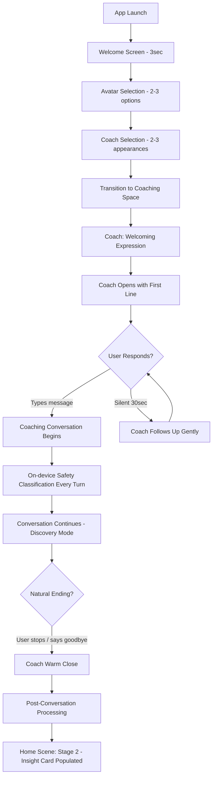

| Step | Duration | What Happens | Design Notes |
|------|----------|-------------|--------------|
| **Welcome** | 3 sec | Brand moment — app name, tagline, warm earthy gradient. Auto-advances. | No buttons. Just a breath. Sets tone. |
| **Avatar Selection** | 15-30 sec | 2-3 style options. Tap to select. | "This is you." Circular portraits, earthy palette. |
| **Coach Selection** | 15-30 sec | 2-3 coach appearances. Each shows name + one-line personality hint. | "Meet your coach." Act of agency deepens relationship from start. |
| **Transition** | 400-500ms | Crossfade to conversation view. Coach character appears. | Threshold crossing from selection to coaching space. |
| **First Line** | Immediate | Warm, non-generic opening with personality. | Cold-start capable for all personas + Curious Skeptic. |
| **Conversation** | 5-15 min | Real coaching. Discovery Mode. No questionnaire. | Turn one of the one continuous thread. Lives forever. |
| **Close** | Natural | No forced ending. Coach may suggest wrapping up. | No "session complete" modal. |
| **Home Scene** | Immediate | Stage 2: avatar + greeting + insight card from first conversation. | The home scene has come to life. |

**Error Paths:**
- **Force-quit during onboarding:** Onboarding progress persisted per-step. Each completed step saved locally. Re-launch resumes from last incomplete step (e.g., picked avatar but not coach → resume at coach selection).
- **Silence after first line:** Coach follows up gently after 30 seconds in-conversation (not a push notification).
- **Network failure:** "Having trouble connecting. Your coach will be right back." Auto-retry. Conversation state preserved locally.

---

### Journey 2: Daily Return → Coaching Exchange

The core loop. Most repeated journey.

**Entry:** User opens app.

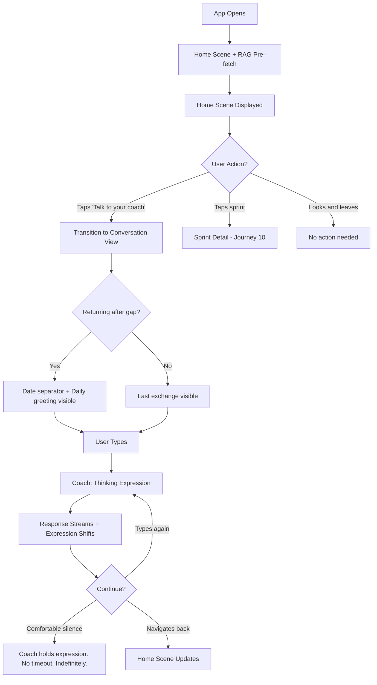

**Key:** Pre-fetch ensures zero delay. Daily greeting is daily Moment 2 renewal. No forced interaction — looking and leaving is valid.

---

### Journey 3: Conversation → Sprint Creation

Coach proposes, user confirms. Sprints are born in dialogue.

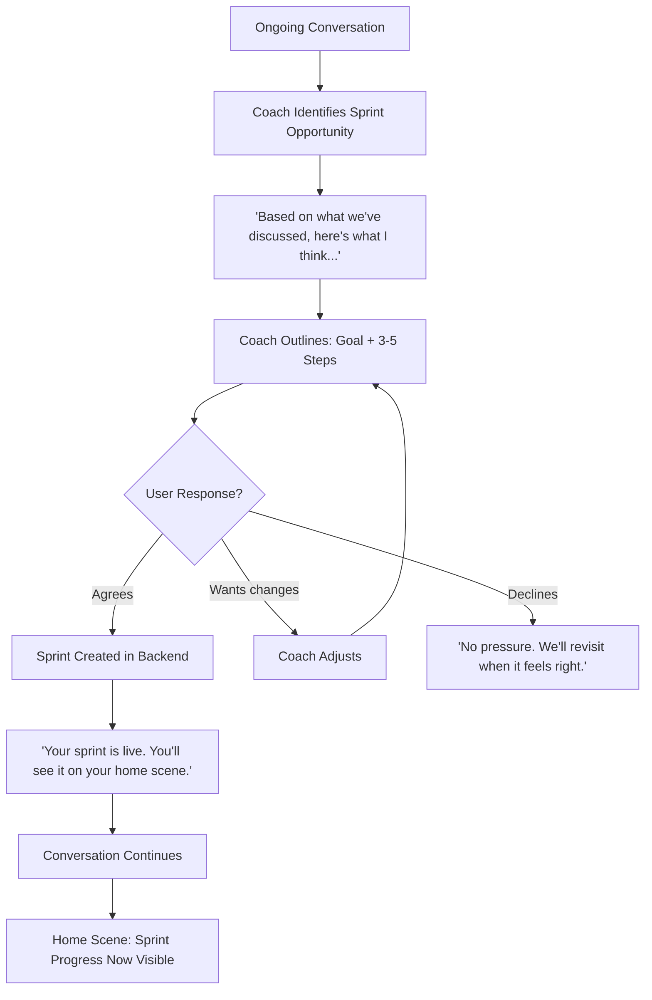

**Interrupted sprint recovery:** If a sprint proposal was generated but not confirmed (network failure, app crash), the coach re-surfaces it in the next conversation: "Before we start, I had a sprint idea from our last conversation. Want to revisit it?"

**No sprint creation UI.** Sprints are born in conversation only. The sprint detail view is for tracking, not creation.

---

### Journey 4: Sprint Detail View

Coaching context, not task management.

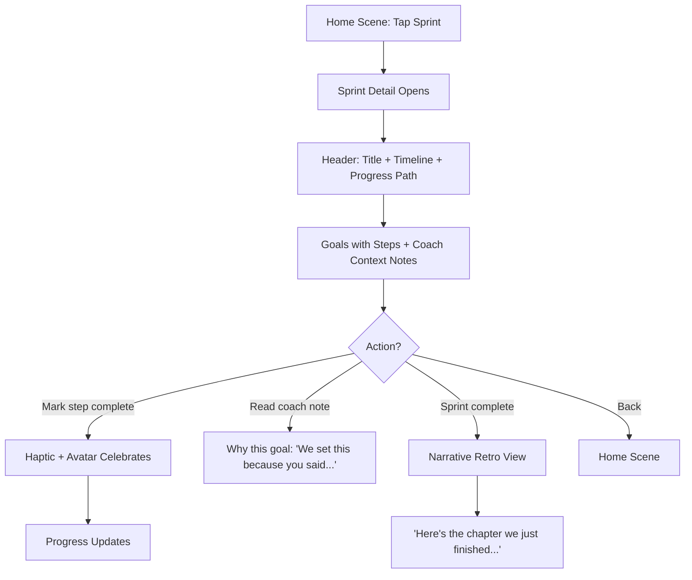

**Each goal includes a coach context note** in the coach's voice, explaining why it was set. This is what separates coaching context from a todo list. No ability to create sprints from this view.

---

### Journey 5: Mid-Conversation Safety Boundary

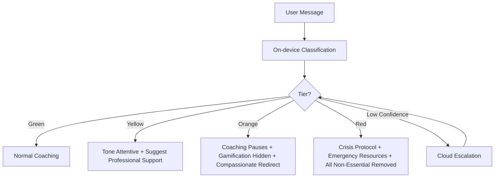

| Tier | UI Changes | Coach Behavior | User Feels |
|------|-----------|---------------|------------|
| **Green** | None | Full coaching | Normal |
| **Yellow** | Subtle warmth increase, gentle expression | Coaching with care, suggests professional support as option | Cared for, not flagged |
| **Orange** | Noticeable softening, sprint/gamification hidden | Pauses coaching, compassionate redirect with resources | Protected |
| **Red** | Maximum calm, all non-essential removed, crisis resources prominent | Crisis protocol, emergency numbers, stop all frameworks | Safe — the app became a lifeline |

**Safety state sticky minimum duration:** Once Orange or Red is triggered, the UI stays in that state for at least 3 subsequent turns (or until Green is classified twice consecutively). Prevents visual flickering during extended sensitive conversations. De-escalation is gradual and stable.

**All transitions immediate** — no animation delay on safety escalation. Boundary Response Compliance target: 100%.

---

### Journey 6: Active Coaching → Pause Mode

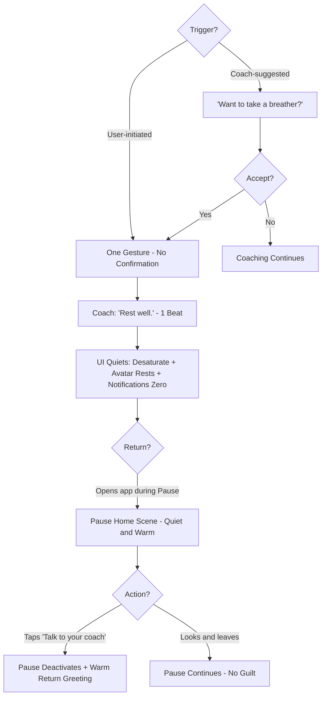

**One gesture, no confirmation, immediate respect.** Zero notifications during Pause. Zero "you've been away" messaging. Opening the app during Pause is restful, not a reminder to re-engage.

---

### Journey 7: Search for Past Exchange

Two complementary paths: ask the coach (semantic) or search directly (keyword).

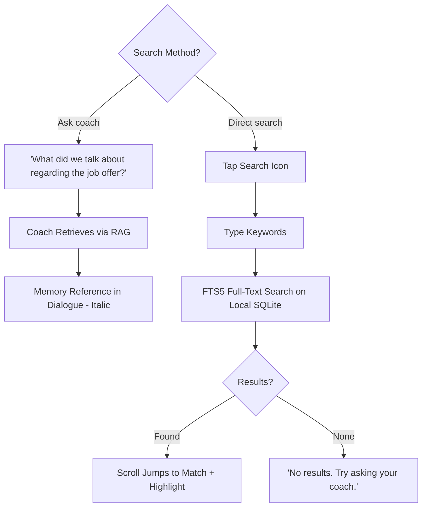

**FTS5 full-text search index** on conversation turns — schema decision at database design stage. Conversation turns indexed for fast keyword search. Coach-as-search is the primary path (richer, more relational); direct search is the utilitarian fallback.

---

### Journey 8: Viewing & Editing Coach Memory

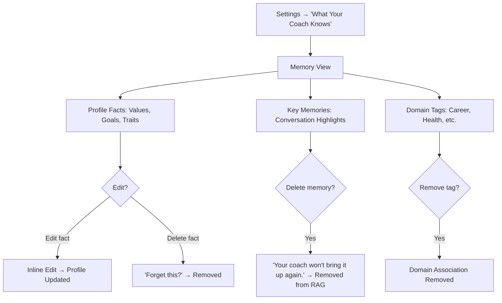

**Profile edits take effect on the next conversation turn.** Updated profile included in next LLM prompt context. The coach may naturally acknowledge: "I noticed you updated your priorities. Tell me more about that shift."

**Warm deletion language throughout.** "Forget this?" not "Delete entry?" Profile facts displayed in natural language, not raw data. Footer: "Your data stays on your phone. You can export or delete everything anytime."

---

### Journey 9: Avatar & Coach Customization

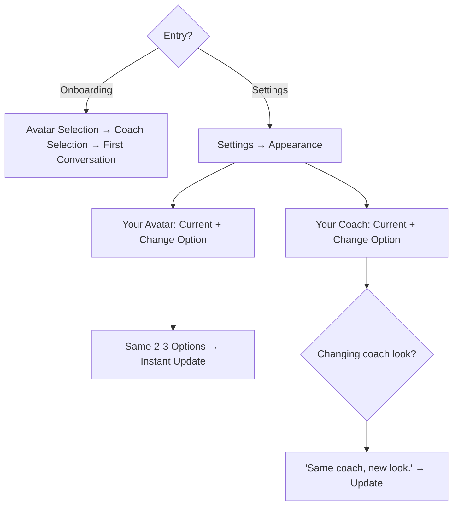

**Onboarding: quick selections (2-3 each), tap to select.** Settings: change anytime. Avatar changes instant, no confirmation. Coach appearance changes include warm reassurance that personality/memory stays the same.

---

### Journey 10: Sprint Progress Check from Home

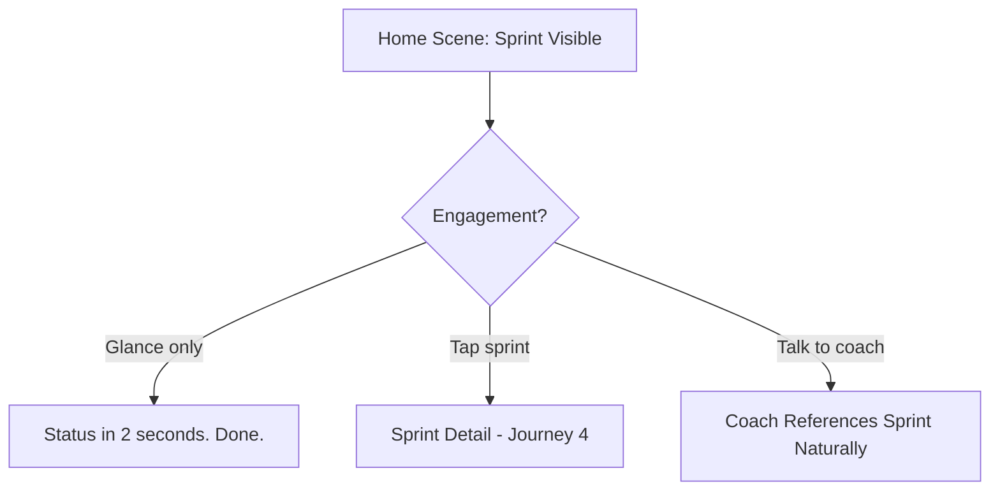

**Three engagement levels** for the same data: glance (home scene), interact (detail view), discuss (conversation). User chooses depth.

---

### Journey 11: Conversation History Export

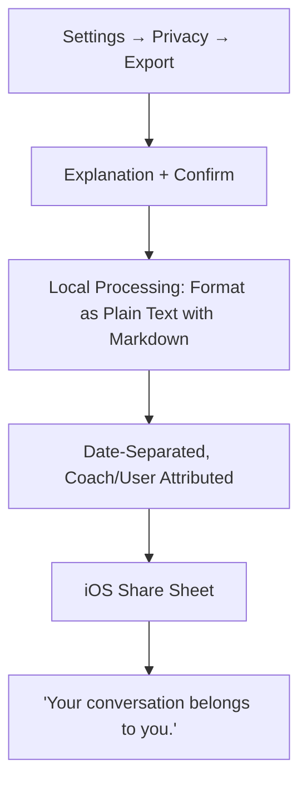

**Export format: plain text with markdown.** Coach text as paragraphs, user text as blockquotes. Date separators as headers. Universal, readable in any app. No rendering library needed. PDF deferred to Phase 2. Lives in Settings → Privacy — no export button in the conversation view. Generated on-device from local SQLite.

---

### Journey 12: Offline Conversation

The app is there even without internet.

**Entry:** User taps "Talk to your coach" without connectivity.

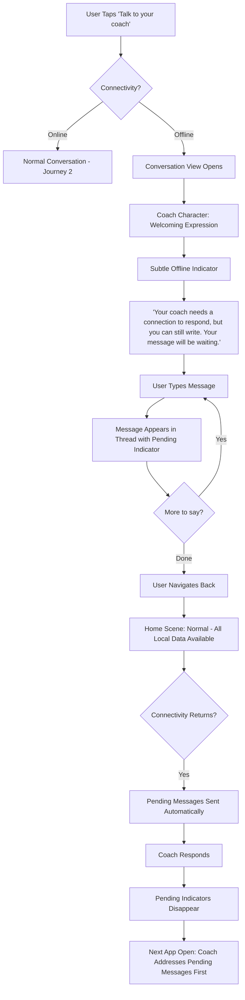

**Offline Capabilities:**

| Feature | Offline? | Notes |
|---------|----------|-------|
| Home scene | Full | All local data — avatar, insight, sprint, check-in |
| Sprint detail | Full | View goals, mark steps complete (syncs when online) |
| Search | Full | FTS5 search on local SQLite |
| Coach memory view | Full | Profile and memories are local |
| Settings & customization | Full | All preferences local |
| Conversation — reading history | Full | Continuous thread is local |
| Conversation — sending messages | Pending | Message saved locally, sent when connectivity returns |
| Conversation — coach responses | Requires connectivity | LLM inference is cloud-only |
| Safety classification | Full | On-device Apple Foundation Models — works offline |
| Export | Full | Generated from local data |

**Design Principles:**
- The app never shows a hard "no internet" error that blocks usage. The home scene, sprint, search, memory view, and conversation history all work fully offline.
- The conversation view accepts input offline — messages are queued as "pending" with a subtle indicator (not an error state, not a warning — just a gentle visual note).
- When connectivity returns, pending messages are sent automatically and the coach responds. The coach's first response after an offline gap may acknowledge the delay naturally.
- The offline indicator in the conversation view is subtle — a small icon or text near the coach status, not a banner that dominates the screen.
- Marcus on a subway after a tough meeting can open the app, see his avatar, check his sprint, and write down what's on his mind. The app is *there*.

---

### Journey Patterns

Reusable patterns across all twelve journeys:

**Navigation Patterns:**

| Pattern | Journeys | Description |
|---------|----------|-------------|
| **Threshold crossing** | 1, 2 | Home scene → conversation view. Crossfade + upward motion. |
| **One-tap primary action** | 2, 10 | "Talk to your coach" always one tap from home. |
| **Settings as your space** | 7, 8, 9, 11 | All data management, customization, export live in Settings. |
| **Contextual tab bar** | All | 2-3 tabs, auto-hides during sessions and Pause Mode. |

**Conversation Patterns:**

| Pattern | Journeys | Description |
|---------|----------|-------------|
| **Coach proposes, user confirms** | 3, 6 | Sprints, Pause Mode born in dialogue, not forms. |
| **Comfortable silence** | 2, 6 | No timeout. Coach holds expression. No prompts. |
| **Ambient state shifts** | 2, 5 | Mode transitions through environmental cues. Safety overrides all. |
| **Memory surfaces** | 2, 7 | Italic at reduced opacity. UI-driven via `memory_reference: true`. |
| **Pending messages** | 12 | Offline input queued, sent on connectivity return. |

**Feedback Patterns:**

| Pattern | Journeys | Description |
|---------|----------|-------------|
| **Haptic at earned moments** | 4, 10 | ≤3 trigger types per Calm Budget. |
| **Avatar state reflects coaching** | 2, 4, 6 | Active, resting, celebrating, thinking, struggling. |
| **Progressive disclosure** | 2 | Home scene elements appear as data becomes available. |

**Safety Patterns:**

| Pattern | Journeys | Description |
|---------|----------|-------------|
| **Immediate escalation** | 5 | No animation delay on safety tier change. |
| **Sticky minimum duration** | 5 | Orange/Red holds for 3 turns minimum. No flickering. |
| **Safety overrides ambient** | 5 | One state at a time. Safety suppresses coaching mode shifts. |

**Trust Patterns:**

| Pattern | Journeys | Description |
|---------|----------|-------------|
| **Warm deletion language** | 8 | "Forget this?" not "Delete entry?" |
| **Coach's voice in data** | 4, 8 | Natural language, not structured data. |
| **Export reinforces ownership** | 11 | "Your conversation belongs to you." |
| **Per-step persistence** | 1 | Onboarding progress saved per-step. No restart on force-quit. |
| **Interrupted recovery** | 3 | Unconfirmed sprint proposals re-surfaced next conversation. |

**Data Patterns:**

| Pattern | Journeys | Description |
|---------|----------|-------------|
| **Profile edits → next turn** | 8 | Updated profile included in next LLM prompt. Coach may acknowledge. |
| **FTS5 search index** | 7 | Conversation turns indexed at schema level for fast keyword search. |
| **Offline-first local data** | 12 | Home scene, sprint, search, memory, history all work without connectivity. |

### Flow Optimization Principles

1. **Every journey has a one-step entry.** No journey requires more than one tap from the home scene.

2. **Conversations absorb complexity.** Sprint creation, Pause Mode suggestion, safety boundaries — all within the conversation flow rather than separate UI.

3. **Data creation in conversation; data viewing in dedicated views.** Sprints created by talking. Viewed in sprint detail. Memories created by conversing. Viewed in "What Your Coach Knows."

4. **Every error state has a warm recovery.** Network failure: "Your coach will be right back." No search results: "Try asking your coach." Memory gap: "Remind me?" Offline: "You can still write."

5. **The home scene is the hub; the conversation is the destination.** Every journey starts from or returns to home. Home absorbs results of every interaction.

6. **Offline is graceful, never blocking.** The app works for everything local. Conversation accepts input. Only coach responses require connectivity.

## Component Strategy

### Design System Coverage

**SwiftUI provides (use as-is):** Layout engine, Dynamic Type, VoiceOver, reduced motion, color scheme detection, safe areas, keyboard avoidance, haptics, navigation stack, Form/Toggle (for Settings).

**Custom components needed:** 17 components across three build tiers. Every component uses the `CoachingTheme` token system — no hardcoded values.

### State Combination Resolution Rules

Four rules resolve every cross-state interaction. These are global — all components observe them.

1. **Safety always wins.** Safety tier overrides Pause Mode, coaching mode ambient shifts, and all other visual states. A user in Pause Mode who triggers Orange gets Orange. A user in Directive mode who triggers Yellow gets Yellow. No exceptions.
2. **Pause Mode suppresses sprint and gamification.** During Pause: no sprint visibility, no step completion, no haptics, no gamification elements. The home scene shows only avatar (resting) + Pause insight + "Talk to your coach" button.
3. **Offline doesn't affect visual state.** Safety classification works offline (on-device). Theme stays correct. Only coach responses are unavailable. All visual states, expressions, and ambient shifts work normally for locally-driven interactions.
4. **Only one ambient state at a time.** Safety overrides coaching mode. If no safety override, coaching mode (Discovery/Directive/Challenger) drives the ambient shift. Never both simultaneously.

### Complete Component Inventory

**Tier 1 — Ship First (Build Priority 1-4):**

#### `CoachCharacterView`

| Attribute | Specification |
|-----------|--------------|
| **Purpose** | The coach's visual presence in the conversation view. The RPG paradigm's anchor. |
| **Anatomy** | Portrait circle (100pt default, 80pt at accessibility XL+) + name label + status text. Vertically stacked, centered. |
| **States** | 5 expressions: welcoming, thinking, warm, focused, gentle. State-driven asset swap with SwiftUI crossfade. |
| **Behavior** | Pinned at top (sticky). Two transitions per turn: → thinking on user send, → contextual on response complete. Expression from LLM structured output `mood` field. **Built with search hook from Week 1** — empty optional slot for `SearchOverlayView` filled in Week 11. |
| **Accessibility** | `accessibilityLabel: "Your coach"`. `accessibilityValue` updates with expression state. Changes announced. |
| **Tokens** | `coachPortraitGradient`, `coachPortraitGlow`, `coachNameText`, `coachStatusText`, `Animation.expressionShift` |
| **Assets** | 5 static illustrations at 2x/3x. Thinking is highest-priority art asset. |

#### `DialogueTurnView`

| Attribute | Specification |
|-----------|--------------|
| **Purpose** | A single conversation turn in the continuous thread. |
| **Variants** | **Coach turn:** unmarked prose, `Font.coachVoice`, `coachDialogue` color. **User turn:** left-border accent, 12pt indent, `Font.userVoice`, `userDialogue` color. **Memory reference:** coach variant with italic + 0.7 opacity (structured output `memory_reference: true`). **Coach emphasis:** semibold spans (structured output emphasis markers). **Pending:** user variant with `PendingMessageIndicator` when `status: .pending`. |
| **Spacing** | `Spacing.dialogueTurn` (24pt) between turns. `Spacing.dialogueBreath` (8pt) within multi-paragraph turns. |
| **Accessibility** | Each turn: `accessibilityLabel` prefixed "Coach says:" or "You said:". Memory references: hint "Referencing a past conversation." Pending: hint "Message pending." |
| **Tokens** | `Font.coachVoice`, `Font.userVoice`, `Font.coachVoiceEmphasis`, `coachDialogue`, `userDialogue`, `userAccent`, `Spacing.dialogueTurn` |

#### `TextInputView`

| Attribute | Specification |
|-----------|--------------|
| **Purpose** | User message input at bottom of conversation view. |
| **Anatomy** | Pill-shaped text field (20pt radius) + circular send button (32pt). |
| **States** | **Empty:** placeholder "What's on your mind..." **Typing:** text in `userDialogue`, send activates. **Offline:** placeholder "Write a message..." — input functional, messages queued. |
| **Behavior** | Send on button tap or Return. Keyboard avoidance via SwiftUI. Multi-line up to 4 lines, then internal scroll. |
| **Accessibility** | `accessibilityLabel: "Message your coach"`. Send: `accessibilityLabel: "Send message"`. |
| **Tokens** | `inputBorder`, `userDialogue`, `coachStatusText`, `sendButton`, `Radius.input` |

#### `HomeSceneView`

| Attribute | Specification |
|-----------|--------------|
| **Purpose** | The unified home scene — your space. Layout B (Compact & Personal). |
| **Anatomy** | Top: `HStack` — `AvatarView` (64pt) + greeting area. Below: `VStack` — `InsightCard`, `SprintPathView` (compact), check-in summary, spacer, `CoachActionButton`. |
| **Progressive Disclosure** | Stage 1: avatar + greeting + button. Stage 2: + insight card. Stage 3: + sprint + check-in. Stage 4 (Pause): sprint muted, insight softens, avatar rests. Boolean conditions per element. |
| **Behavior** | Pre-fetches RAG context + daily greeting on appear. Tap sprint → detail. Tap button → conversation. |
| **Tokens** | Full home scene palette. All spacing tokens. |

#### `InsightCard`

| Attribute | Specification |
|-----------|--------------|
| **Purpose** | Memory surface on the home scene — the coach's latest thought about you. |
| **Anatomy** | Rounded container (`Radius.container`: 16pt, `insightBackground`). Label (`Font.sprintLabel`, `homeTextSecondary`) + content text (`Font.insightText`, `homeTextPrimary`). |
| **Content Variants** | **Stage 2 (post-onboarding):** "Your coach is getting to know you. Here's what stood out from your first conversation: [summary]." **Stage 3 (active):** RAG-informed insight from most recent conversation. Refreshed per completed session. **Stage 4 (Pause):** "Your coach is here when you're ready." **Daily greeting tie-in:** The insight text may preview what the daily greeting will reference. |
| **Behavior** | Content populated from RAG pre-fetch. One insight displayed at a time. Not tappable — read-only. |
| **Accessibility** | Full text readable by VoiceOver. `accessibilityLabel: "Coach insight: [content]"`. |
| **Tokens** | `insightBackground`, `Font.insightText`, `Font.sprintLabel`, `homeTextPrimary`, `homeTextSecondary`, `Radius.container`, `Spacing.insightPadding` |

#### `AvatarView`

| Attribute | Specification |
|-----------|--------------|
| **Purpose** | The user's visual representation on the home scene. |
| **Sizes** | 64pt on home scene. Scales proportionally elsewhere. |
| **States** | 5 appearances: active, resting, celebrating, thinking, struggling. Simplified painterly — posture/silhouette emphasis. |
| **Behavior** | State from coaching backend. SwiftUI crossfade. Celebrating is brief (triggered by step completion, returns to active). |
| **Accessibility** | `accessibilityLabel: "Your avatar"`. `accessibilityValue`: state name. |
| **Assets** | 5 states × 2-3 appearance variants × 2x/3x. |

#### `CoachActionButton`

| Attribute | Specification |
|-----------|--------------|
| **Purpose** | "Talk to your coach" — primary action. |
| **Anatomy** | Full-width, `Radius.button` (16pt), gradient `primaryAction`, `Font.primaryButton`. |
| **States** | Default, pressed (darker). Always enabled — user can always talk to coach, even during Pause (which deactivates Pause). |
| **Accessibility** | `accessibilityLabel: "Talk to your coach"`. `accessibilityHint: "Opens your coaching conversation"`. |

#### `SafetyStateManager`

| Attribute | Specification |
|-----------|--------------|
| **Purpose** | Theme transformer for safety tiers. Logic component, not a view. |
| **States** | Green (no change), Yellow, Orange, Red. |
| **Behavior** | Receives on-device classification every turn. Applies relative transformations to active `CoachingTheme`. Sticky minimum: Orange/Red holds 3 turns or Green×2 consecutive. Outputs modified theme + visibility flags (`showSprint`, `showGamification`, `showCrisisResources`). |
| **Follows rule 1:** Safety always wins over all other states. |

---

**Tier 2 — Ship Second (Build Priority 5-6):**

#### `SprintPathView`

| Attribute | Specification |
|-----------|--------------|
| **Purpose** | Spatial "you are here" progress visualization. |
| **Sizes** | **Home scene:** compact strip (5pt height, trail metaphor). **Sprint detail:** expanded with step nodes and labels. |
| **Behavior** | Home: glanceable in 2 seconds. Detail: tappable nodes for step info. |
| **Accessibility** | `accessibilityLabel: "Sprint progress"`. `accessibilityValue: "Step 4 of 7, day 9 of 14"`. |
| **Tokens** | `sprintTrack`, `sprintProgress`, `accent`, `homeTextSecondary` |
| **Suppressed during Pause Mode** (rule 2). |

#### `SprintDetailView`

| Attribute | Specification |
|-----------|--------------|
| **Purpose** | Full sprint view with goals, steps, coach context notes. |
| **Anatomy** | Header (title + timeline + expanded `SprintPathView`) → Goals list (each with italic coach context note + steps with completion toggle) → Narrative retro section (when complete). |
| **States** | **Active:** interactive steps, progress updating. **Complete:** narrative retro — "Here's the chapter we just finished." |
| **Behavior** | Tap step → complete → haptic → avatar celebrates. No sprint creation from this view. Coach context notes in `Font.insightText`, italic, coach's voice. |
| **Accessibility** | Steps: `accessibilityHint: "Double tap to mark complete"`. Coach notes: prefixed "Your coach says:". |
| **Suppressed during Pause Mode** (rule 2). |

---

**Tier 3 — Ship Before Launch (Build Priority 7):**

#### `SearchOverlayView`

| Attribute | Specification |
|-----------|--------------|
| **Purpose** | In-conversation keyword search. |
| **Anatomy** | Search icon (in coach character area hook) → expands to text field + results count + up/down navigation + dismiss. |
| **States** | Collapsed (icon only), expanded (field + nav), results found (highlights in thread), no results (message + coach suggestion). |
| **Behavior** | FTS5 query on local SQLite. Results highlighted inline. Scroll jumps to match. Position preserved on dismiss. Works fully offline. |
| **Accessibility** | Field: `accessibilityLabel: "Search conversation history"`. Results: `accessibilityLabel: "Result 3 of 7"`. |

#### `MemoryView`

| Attribute | Specification |
|-----------|--------------|
| **Purpose** | "What Your Coach Knows" — transparency for RAG data. |
| **Anatomy** | Three sections: Profile Facts (editable, deletable), Key Memories (browsable, deletable), Domain Tags (removable). Privacy footer. |
| **States** | Browse, edit (inline), delete confirmation (warm language). |
| **Behavior** | Edits → next conversation turn. Deletions → immediate RAG removal. Natural language display, not raw data. |
| **Accessibility** | Edit: `accessibilityHint: "Double tap to edit"`. Section headers as VoiceOver headings. |

#### `SettingsView`

| Attribute | Specification |
|-----------|--------------|
| **Purpose** | App settings. Home scene palette + coaching typography + SwiftUI Form. |
| **Sections** | Appearance (→ avatar/coach selection), Your Coach (→ memory view), Notifications (toggles), Privacy (data info, export, delete), About. |
| **Privacy section** gets extra design care — reassuring, not bureaucratic. |

#### `OnboardingWelcomeView`

| Attribute | Specification |
|-----------|--------------|
| **Purpose** | 3-second brand moment. Moment 0. |
| **Anatomy** | Centered wordmark + tagline. Earthy gradient. Auto-advances. Not skippable. |
| **Accessibility** | `accessibilityLabel: "AI Life Coach. [tagline]"`. VoiceOver announces, auto-advances. |

#### `AvatarSelectionView`

| Attribute | Specification |
|-----------|--------------|
| **Purpose** | Avatar picker. Onboarding + Settings. |
| **Anatomy** | "This is you" header + 2-3 circular options + confirm. Selected: glow ring. |
| **Behavior** | Tap to select. Per-step persistence (survives force-quit). Settings: instant change. |

#### `CoachSelectionView`

| Attribute | Specification |
|-----------|--------------|
| **Purpose** | Coach appearance picker. Onboarding + Settings. |
| **Anatomy** | "Meet your coach" header + 2-3 options (portrait + name + personality hint) + confirm. |
| **Behavior** | Same persistence. Settings change: "Same coach, new look" confirmation. |

#### `PauseModeTransition`

| Attribute | Specification |
|-----------|--------------|
| **Purpose** | Visual calming when Pause activates/deactivates. Transition effect, not persistent view. |
| **Behavior** | 1200ms desaturation. Avatar → resting. Insight → Pause message. Sprint muted. Dark mode: near-monochrome, avatar retains glow. |
| **Follows rule 1:** Safety overrides Pause. If safety is active during Pause, safety visual wins. |
| **Accessibility** | Reduced motion: instant change. VoiceOver: "Pause Mode activated." |

#### `OfflineIndicator`

| Attribute | Specification |
|-----------|--------------|
| **Purpose** | Subtle connectivity status in conversation view. |
| **Anatomy** | Small text/icon near coach status. Same visual weight as "Thinking..." |
| **States** | Online (invisible), offline (visible), reconnecting, reconnected (fades). |
| **Follows rule 3:** Offline doesn't affect visual state. Only indicates connectivity. |

#### `PendingMessageIndicator`

| Attribute | Specification |
|-----------|--------------|
| **Purpose** | Visual indicator on offline-queued user messages. |
| **Anatomy** | Small subtle icon beside user turn. |
| **States** | Pending (visible), sent (fades). |
| **Applied to** `DialogueTurnView` user variant when `status: .pending`. |

#### `DateSeparatorView`

| Attribute | Specification |
|-----------|--------------|
| **Purpose** | Date markers in the continuous thread. |
| **Anatomy** | Centered text: "Today" / "Yesterday" / absolute date for older. |
| **Accessibility** | VoiceOver landmark. `accessibilityLabel: "Conversation from [date]"`. |

### Component Composition Maps

**Home Scene:**
```
HomeSceneView
├── HStack
│   ├── AvatarView (64pt)
│   └── VStack (greeting, name, status)
├── InsightCard (4 content variants by stage)
├── SprintPathView (compact) [hidden in Stage 1-2, Pause]
├── CheckInSummary [hidden until first check-in]
├── Spacer
└── CoachActionButton
```

**Conversation View:**
```
ConversationView
├── CoachCharacterView (pinned, with search hook slot)
│   └── [SearchOverlayView fills hook in Week 11]
├── ScrollView
│   └── LazyVStack (paginated, lazy-loaded)
│       ├── DateSeparatorView
│       ├── DialogueTurnView (coach variant)
│       ├── DialogueTurnView (user variant, with PendingMessageIndicator if offline)
│       ├── DialogueTurnView (memory_reference variant)
│       └── ...
├── OfflineIndicator (when offline)
└── TextInputView
```

**Sprint Detail:**
```
SprintDetailView
├── Header (title, timeline)
├── SprintPathView (expanded, step nodes)
├── ForEach goals
│   ├── GoalHeader + Coach Context Note (italic)
│   └── ForEach steps → StepRow (completion toggle + haptic)
└── Narrative Retro Section (when complete)
```

**Settings:**
```
SettingsView (SwiftUI Form)
├── Appearance → AvatarSelectionView, CoachSelectionView
├── Your Coach → MemoryView
├── Notifications → Toggles
├── Privacy → Export flow, Delete account
└── About
```

### Implementation Roadmap

**Art Asset Dependency (Critical Path):**
- **Week 1:** Art direction brief sent to artist — expression states, sizing, earthy palette, 2x/3x requirements, all 5 coach expressions + 5 avatar states × 2-3 variants
- **Weeks 3-4:** First drafts reviewed, feedback provided
- **Weeks 8-9:** Final assets delivered
- **Weeks 11-12:** Assets integrated, replacing placeholders
- **Risk:** If art is late, visual identity ships with placeholders, which breaks the five-person validation test. Art is on the critical path.

**Parallel Track — RAG Pipeline (Critical Dependency):**
- **Weeks 1-4:** RAG pipeline (post-conversation summarization, embedding generation via on-device model, vector storage in sqlite-vec, retrieval by topic + recency) must be built alongside conversation UI
- Daily greeting, memory surfaces, coach specificity, and the "it remembers me" defining experience all depend on RAG being functional by Week 4 core loop validation
- Without RAG, the conversation UI is a beautiful shell around a generic chatbot

**Week 1-2 — Foundation:**
- `CoachingTheme` struct + 4 theme instances
- `DialogueTurnView` (all variants including pending)
- `TextInputView`
- `CoachCharacterView` (with placeholder art + search hook slot)
- `DateSeparatorView`
- Basic `ConversationView` composition
- **Validation:** Empty conversation state shown to 5 people

**Week 3-4 — Home + Core Loop:**
- `HomeSceneView` with progressive disclosure (all 4 stages)
- `InsightCard` (all 4 content variants)
- `AvatarView` (placeholder art)
- `CoachActionButton`
- Threshold crossing transition
- `SafetyStateManager` (simple show/hide)
- **Validation:** Full core loop — home → conversation → home

**Week 5-6 — Sprint + Detail:**
- `SprintPathView` (compact + expanded)
- `SprintDetailView` with coach context notes
- Step completion with haptic
- **Validation:** Sprint in conversation → home → detail → complete step

**Week 7-8 — Onboarding + Customization:**
- `OnboardingWelcomeView`
- `AvatarSelectionView`
- `CoachSelectionView`
- Per-step persistence
- **Validation:** Complete onboarding end-to-end

**Week 9-10 — Settings + Memory:**
- `SettingsView`
- `MemoryView` (profile facts, memories, domain tags)
- Export flow (plain text markdown via iOS share sheet)

**Week 11-12 — Polish + Safety + Search + Offline:**
- `SafetyTransitionAnimator` (smooth palette shifts)
- `PauseModeTransition` (desaturation)
- `SearchOverlayView` (fills hook in `CoachCharacterView`)
- `OfflineIndicator` + `PendingMessageIndicator`
- Final art assets integration

**Week 13-14 — Testing + Refinement:**
- All four palettes tuned on-device
- Accessibility: VoiceOver, Dynamic Type XXL, reduced motion
- Performance: oldest supported device
- Color contrast: WCAG AA verification
- Color blindness simulation
- State combination testing per resolution rules

## UX Consistency Patterns

This section consolidates all interaction patterns into a single reference for consistent implementation.

### Loading States

The app never shows spinners, progress bars, or generic loading indicators.

| Context | Loading State | Design |
|---------|-------------|--------|
| **Coach thinking** | Coach character thinking expression | Character moment, not a wait. 500ms-3s typical. |
| **Home scene load** | Progressive: avatar first (cached), then greeting, then insight (RAG pre-fetch) | No skeleton screens. Elements fade in (quick: 0.25s). |
| **Conversation scroll-up** | LazyVStack pagination | Imperceptible. Turns appear as user reaches them. |
| **Sprint detail** | Local SQLite cache | Instant. No perceptible load. |
| **Search results** | FTS5 inline | <200ms. Results highlight in real-time. |
| **Export generation** | "Preparing your conversation..." | 1-5s. The one acceptable brief wait. |
| **Network reconnection** | Pending indicators disappear, coach responds | Automatic. No loading indicator. |

**Principle:** If the user can see something meaningful while waiting, show it. If not, make the wait a character moment or intentional pause.

### Empty States

Every zero-data state feels intentionally designed.

| Screen | Empty State | Tone |
|--------|-----------|------|
| **Home (Stage 1)** | Avatar + greeting + button only | "Your story starts here" — warm potential |
| **Home — no sprint** | Sprint area absent | No acknowledgment of absence |
| **Home — no check-in** | Check-in area absent | No guilt messaging |
| **Conversation — first ever** | Coach welcoming + empty space + input | "Your coach is waiting" |
| **Conversation — long gap** | Date separator showing gap + coach greeting acknowledges time | "Still here" |
| **Memory view — new user** | "Your coach is still learning about you" | Getting to know you |
| **Search — no results** | "No matches. Try asking your coach." | Helpful redirect |

**Principle:** Never show "empty" or "no data." Every zero-state has a warm, forward-looking message. Absence is potential, not failure.

### Error Messaging

Every error has a warm recovery path.

| Error | User Sees | Recovery |
|-------|----------|----------|
| **Network failure (conversation)** | "Having trouble connecting. Your coach will be right back." | Auto-retry. User can type (pending queue). |
| **Network failure (app open)** | Home loads normally. Offline indicator in conversation. | Most features work offline. |
| **LLM provider error** | "Your coach needs a moment. Try again shortly." | Retry button after 10s. |
| **RAG retrieval failure** | Nothing visible | Coach responds without memory context. Logged. |
| **Safety classification failure** | Fail-safe to Yellow | Classification recovers → Yellow clears immediately (no sticky rule on fail-safe). **Fail-safe classifications carry `source: .failsafe` flag — sticky minimum (3 turns) applies only to `source: .genuine` classifications.** |
| **Export failure** | "Couldn't prepare your export. Try again in a moment." | Retry option. |
| **Sprint save failure** | Coach says: "I had trouble saving that. Let me try again." | In-character retry. Error stays within the relationship. |
| **Database corruption** | "Something went wrong with your data. We're working on it." | Contact support, attempt recovery, or start fresh (with explicit data loss warning). |

**Principles:**
1. Errors stay in character when possible — coach handles it in dialogue.
2. Never show technical details — no HTTP codes, no "timeout."
3. Always offer a path forward.
4. Fail toward safety — default to more cautious tier, not less.

### Confirmation Patterns

| Action | Confirmation? | Rationale |
|--------|--------------|-----------|
| Send message | No | Instantaneous. Never confirm. |
| Mark step complete | No | Tap + haptic is the confirmation. |
| Activate/deactivate Pause | No | One gesture, immediate respect. |
| Change avatar | No | Your choice, instant. |
| Change coach appearance | Soft — informational | "Same coach, new look." Reassurance, not permission. |
| Delete memory/fact | Yes — warm | "Forget this?" Irreversible personal data. |
| Export conversation | Yes — informational | Brief explanation of what's exported. |
| Delete account | Yes — serious | Multi-step. Requires typing "DELETE." |

**Principle:** Only confirm irreversible personal data actions. Never confirm reversible interactions.

### Notification Patterns

Governed by the Calm Budget: ≤1/day, zero during Pause.

| Type | Copy Pattern | Anti-Pattern |
|------|-------------|-------------|
| **Check-in nudge** | "Your coach has a thought for you." | "You haven't checked in today!" |
| **Sprint milestone** | "You hit a milestone. Your coach noticed." | "Congratulations! 5 steps done!" |
| **Pause suggestion** | "Your coach thinks you might need a breather." | "Take a break!" |
| **Return after absence** | No notification sent. Daily greeting handles return. | "We miss you!" / "Come back!" |

**Design:** iOS native style. No badge count ever. No sound — silent notifications only. Tap deep-links to conversation. If user disables notifications at OS level: no in-app nag.

**Test:** "Would I want to receive this at 10pm on a bad day?" If no, don't send it.

### Animation Timing

**Four timing constants:**

```swift
struct AnimationTiming {
    static let instant = 0.0     // Safety transitions — critical, no delay
    static let quick = 0.25      // Functional — search, tabs, indicators, step completion
    static let standard = 0.4    // Character — expressions, avatars, thresholds, fades
    static let slow = 1.2        // Emotional — Pause Mode, celebrations
}
```

Individual animations reference the nearest constant:

| Animation | Constant | Adjustment | Context |
|-----------|----------|-----------|---------|
| Safety tier transition | `instant` | — | Never animated. Immediate. |
| Search overlay expand/collapse | `quick` | — | Utilitarian, fast. |
| Tab bar show/hide | `quick` | — | Functional. |
| Sprint step completion | `quick` | — | Quick + haptic. |
| Pending/offline indicators | `quick` | +50ms appear, +150ms disappear | Reconnection relief settles slower. |
| Coach expression shift | `standard` | — | Calm, not snappy. |
| Avatar state change | `standard` | — | Same timing as coach. |
| Threshold crossing (home → conversation) | `standard` | +100ms (0.5s) | Slightly longer — emotional weight. |
| Threshold return (conversation → home) | `standard` | -100ms (0.3s) | Slightly faster — returning is quicker. |
| Home element fade-in | `quick` | -50ms (0.2s) | Progressive disclosure. Subtle. |
| Insight card content change | `standard` | -100ms (0.3s) | Content swap. |
| Pause Mode activation | `slow` | — | Deliberate. The slowness IS the design. |
| Pause Mode deactivation | `slow` | -600ms (0.6s) | Faster than activation — life returning. |
| Avatar celebration | `slow` | -400ms (0.8s) | Brief joy, spring curve. |

All animations: `accessibilityReduceMotion` → 0ms instant.

**Principle:** `instant` = critical, `quick` = functional, `standard` = character, `slow` = emotional. Speed communicates importance.

### Offline Sync Confirmation

When offline actions sync after connectivity returns:

| Action | Sync Confirmation |
|--------|------------------|
| **Pending messages sent** | `PendingMessageIndicator` fades (quick: 0.25s). No other indication. |
| **Sprint step synced** | Brief subtle color pulse on the synced step (quick: 0.25s). The sprint equivalent of the pending indicator disappearing. Not a system indicator — a visual acknowledgment. |
| **Profile edits synced** | No visible confirmation. Edits are local-first; sync is invisible. |

### Gesture Patterns

| Gesture | Used | Where |
|---------|------|-------|
| **Tap** | Yes | Everywhere. The only required gesture. |
| **Scroll (vertical)** | Yes | All scrollable views. |
| **Swipe back** (iOS edge) | Yes | All navigation. System standard. |
| **Pull to refresh** | No | Nowhere. App updates via pre-fetch and real-time. |
| **Long press** | No | Nowhere in MVP. No hidden complexity. |
| **Pinch/zoom** | No | Nowhere. |

**Principle:** Tap and scroll. Every interaction is discoverable through visible elements. No hidden gestures.

### UI Copy Word Blacklist

Words that must never appear in the app's user-facing UI:

**Blacklisted:** "user," "session," "data," "error," "failed," "invalid," "submit," "retry," "loading," "processing," "notification," "sync," "cache," "timeout," "cancel"

**Preferred replacements:**

| Instead of | Use |
|-----------|-----|
| "user" | "you" / "your" |
| "session" | "conversation" |
| "data" | omit or "your information" |
| "error" / "failed" | describe what happened warmly |
| "submit" | specific verb ("Send," "Save") |
| "retry" | "Try again" |
| "loading" / "processing" | omit (use character moments) |
| "cancel" | "Not now" or "Back" |
| "notification" | omit (never reference the system) |
| "sync" | omit (invisible to user) |

**Principle:** The app speaks like the coach — warm, specific, human. Never like a system. Even settings labels and error messages maintain the coaching tone.

### Spacing & Density Patterns

| Space | Density | Why |
|-------|---------|-----|
| **Home scene** | Medium — 16-20pt between elements | Information-rich but calm. Glanceable. |
| **Conversation view** | Low — 24pt between turns, 1.65 line height | Bear-inspired. Extended reading comfort. |
| **Sprint detail** | Medium — functional with coaching warmth | Purposeful interaction. Efficient but not clinical. |
| **Settings** | Standard iOS — SwiftUI Form defaults + coaching typography | Familiarity. The one place standard density is acceptable. |
| **Onboarding** | Very low — one decision per screen | Emotional tone, not information transfer. |

**Principle:** Closer to the conversation = lower density. Closer to utility = standard density.

## Responsive Design & Accessibility

### Platform Scope

**iPhone only for MVP.** iPad deferred to Phase 2 alongside Android. The coaching experience is designed as a personal, phone-in-hand interaction. Targets iPhone SE (375pt) through iPhone 16 Pro Max (430pt).

### iPhone Screen Size Adaptation

**Strategy: fluid, not breakpoint-based.** SwiftUI handles adaptation natively. No device-specific breakpoints.

| Element | iPhone SE (375pt) | Standard (390-393pt) | Pro Max (430pt) |
|---------|-------------------|---------------------|-----------------|
| **Screen margins** | 16pt (tighter) | 20pt | 20pt |
| **Coach portrait** | 80pt (compact) | 100pt | 100pt |
| **Home avatar** | 56pt | 64pt | 64pt |
| **Dialogue width** | Full minus margins | Full minus margins | Max 390pt centered |
| **All other elements** | Fluid | Fluid | Fluid |

**Content column rule (Pro Max):** On screens wider than 393pt, the entire conversation content column — `CoachCharacterView`, `LazyVStack` of dialogue turns, and `TextInputView` — is capped at 390pt and centered. The earthy background fills the remaining width. This prevents overly long reading lines while maintaining the coaching space visual. The coach character, dialogue, and input all align within the same centered column.

**Key rules:**
1. iPhone SE gets tighter margins (16pt) and compact coach portrait (80pt) — same as Accessibility XL+ rule.
2. Pro Max gets max content width (390pt centered) for reading comfort (~70 chars/line).
3. All other elements are fluid via SwiftUI layout.

**Extreme constraint case: SE + Accessibility XL.** This is the tightest possible layout — 80pt portrait + large Dynamic Type + 16pt margins on 375pt width. **Fallback:** If dialogue area becomes too tight, hide coach name/status text (portrait-only, no labels). Character presence maintained; metadata yields to content. Test this combination specifically.

**Testing priority:** Design on standard (390pt), test on SE for constraints, verify Pro Max for centering. Test SE + Accessibility XL as the extreme case.

### Dynamic Type Strategy

Every text element scales with the user's system text size. Fully supported from xSmall through Accessibility XXXL.

**Type scale at default (Large):**

| Token | Size | iOS Style | Scales |
|-------|------|-----------|--------|
| `Font.coachVoice` | 17pt | Body | Yes |
| `Font.userVoice` | 17pt | Body | Yes |
| `Font.coachVoiceEmphasis` | 17pt SB | Body | Yes |
| `Font.insightText` | 15pt | Subheadline | Yes |
| `Font.sprintLabel` | 13pt | Footnote | Yes |
| `Font.coachName` | 13pt SB | Footnote | Yes |
| `Font.coachStatus` | 11pt | Caption 2 | Yes |
| `Font.dateSeparator` | 11pt | Caption 2 | Yes |
| `Font.homeGreeting` | 14pt | Caption | Yes |
| `Font.homeTitle` | 20pt SB | Title 3 | Yes |
| `Font.primaryButton` | 16pt SB | Callout | Yes |

**Layout adaptations at large sizes:**

| Trigger | Adaptation |
|---------|-----------|
| **Accessibility XL+** | Coach portrait: 100pt → 80pt |
| **Accessibility XXL+** | Home scene avatar+greeting may shift from HStack to VStack if horizontal overflow |
| **Accessibility XXXL** | Insight card: truncate with "Read more" tap. Conversation maintains minimum 60% screen for dialogue. |
| **SE + Accessibility XL** (extreme) | If dialogue area insufficient: hide coach name/status text, portrait-only display |

**Implementation:** All tokens use `Font.system(.body)` etc. — SwiftUI scales automatically. Adaptations use `@Environment(\.dynamicTypeSize)`. Test at Accessibility XL and XXXL.

### Accessibility Compliance

**Target: WCAG 2.1 AA.**

#### Color & Visual

| Requirement | Implementation |
|------------|---------------|
| Text contrast ≥4.5:1 | All 4 palettes verified. Earthy warm tones naturally meet this. |
| Large text contrast ≥3:1 | Title/heading tokens verified. |
| Non-text contrast ≥3:1 | Sprint bar, send button, user accent verified. |
| Color not sole indicator | Safety uses color + element visibility + coach behavior. Never color alone. |
| Line spacing ≥1.5× | Our 1.65 line height exceeds requirement. |

#### Interaction

| Requirement | Implementation |
|------------|---------------|
| Touch targets ≥44pt | All tappable elements meet or exceed. |
| Gesture alternatives | Only tap and scroll. System swipe-back only exception (standard). |
| No timeouts | No time-based limits anywhere. Comfortable silence is infinite. |
| Focus indicators | SwiftUI default focus rings + `.focusable()` on custom components. |

#### Screen Reader (VoiceOver)

| Component | VoiceOver |
|-----------|----------|
| `CoachCharacterView` | Label: "Your coach." Value: expression ("thinking," "ready"). Changes announced. |
| `DialogueTurnView` (coach) | Label: "Coach says: [content]." Memory ref hint: "Referencing a past conversation." |
| `DialogueTurnView` (user) | Label: "You said: [content]." Pending hint: "Message pending, will send when connected." |
| `TextInputView` | Label: "Message your coach." |
| `CoachActionButton` | Label: "Talk to your coach." Hint: "Opens your coaching conversation." |
| `AvatarView` | Label: "Your avatar." Value: state name. |
| `InsightCard` | Label: "Coach insight: [content]." |
| `SprintPathView` | Label: "Sprint progress." Value: "Step [n] of [total], day [n] of [total]." |
| `DateSeparatorView` | Landmark. Label: "Conversation from [date]." |
| `SearchOverlayView` | Field: "Search conversation history." Results: "Result [n] of [total]." |
| `MemoryView` sections | Section headers as VoiceOver headings. Edit hints on facts. |
| **Safety Yellow** | Announced: "Coach is being more attentive." |
| **Safety Orange** | Announced: "Your coach is connecting you with resources." |
| **Safety Red** | Announced: "Safety resources available." Crisis resources announced clearly. |
| **Pause Mode activation** | Announced: "Pause Mode activated. Your coach is here when you're ready." |
| **Pause Mode deactivation** | Announced: "Pause Mode ended. Your coach is ready to talk." |

**VoiceOver navigation order:**
- **Home scene:** greeting → avatar → insight card → sprint progress → "Talk to your coach" button
- **Conversation view:** coach character → dialogue turns (chronological) → input field
- **Conversation with search active:** search field → results navigation → dismiss button. On dismiss: resume normal conversation order.
- **Sprint detail:** header → progress → goals → steps
- **All views:** system back gesture navigates to previous view

#### Reduced Motion

When `accessibilityReduceMotion` is enabled:
- All animations: instant (0ms). No crossfades, transitions, or spring curves.
- Coach expressions: instant swap.
- Threshold crossing: instant cut.
- Pause Mode: instant palette change.
- Avatar celebration: skipped. Haptic only.
- Safety transitions: already instant — no change.
- Content changes during safety (element hiding/showing): also instant.

**Implementation:** Every `withAnimation` checks reduced motion. If true: `.animation(.none)`.

#### Color Blindness

| Simulation | Consideration |
|-----------|--------------|
| **Deuteranopia** | Palette uses warmth/brightness, not red-green. Safety uses element visibility. |
| **Protanopia** | Warm tones remain perceptible. Test send button and user accent specifically. |
| **Tritanopia** | No blues in palette. Minimal impact. |
| **Monochromacy** | Functions on brightness contrast. Attribution by indent/border, not color. |

**Testing:** All 4 palettes × all safety states through Xcode accessibility inspector color blindness simulation.

### Testing Strategy

**Device Matrix:**

| Device | Purpose | Priority |
|--------|---------|----------|
| iPhone 15 (393pt) | Primary development | P1 — daily |
| iPhone SE 3rd gen (375pt) | Constraint testing | P1 — weekly |
| iPhone 15 Pro Max (430pt) | Line length, centering | P2 — bi-weekly |
| iPhone 12 | Performance, animation frame drops | P2 — milestones |
| iPad (any, simulator) | Verify nothing breaks. SwiftUI scales natively — 390pt content column prevents wide lines. | P3 — once in Week 13-14 |

**Accessibility Testing Checklist (run at each milestone):**

- [ ] VoiceOver: navigate entire app eyes-closed. Every element announced. Every action performable.
- [ ] Dynamic Type at Accessibility XL: all layouts intact, coach portrait scaled.
- [ ] Dynamic Type at Accessibility XXXL: conversation usable, home scene doesn't break.
- [ ] **SE + Accessibility XL extreme case:** dialogue area sufficient, fallback triggers if needed.
- [ ] Reduced motion: all animations disabled. App fully functional. Content changes instant.
- [ ] Color blindness simulation: all 4 palettes × deuteranopia, protanopia, tritanopia.
- [ ] Color contrast: automated check all text/background in 4 palettes + safety states.
- [ ] Touch targets: all tappable elements ≥44pt.
- [ ] Keyboard/switch control: full navigation without touch.
- [ ] **Safety × Accessibility cross-test:** All 4 safety tiers verified simultaneously with VoiceOver + Dynamic Type XL + reduced motion. Crisis resources announced clearly at Red. Content fits at Orange/Red + large type. Content changes instant.

**Testing Schedule:**

| When | What |
|------|------|
| Week 2 | VoiceOver on conversation view. Dynamic Type on dialogue. |
| Week 4 | Full VoiceOver: home → conversation → home. Dynamic Type all sizes. SE layout. |
| Week 8 | Onboarding VoiceOver. Color contrast audit. |
| Week 12 | Complete checklist. All devices. Performance on iPhone 12. **Safety × Accessibility cross-test.** |
| Week 13-14 | Full regression. Edge cases. iPad simulator smoke test. |

### iPad Consideration (Deferred)

**Phase 2.** For MVP: SwiftUI apps scale natively to iPad (not iPhone compatibility mode). The 390pt content column prevents absurdly wide lines. Verify in iPad simulator that nothing breaks — but no iPad-specific design.

Phase 2 questions: Split-view (home + conversation side by side) or maintain threshold-crossing metaphor? Larger coach character with more detail? Keyboard-first input? The spatial metaphor may work differently at tablet scale.
